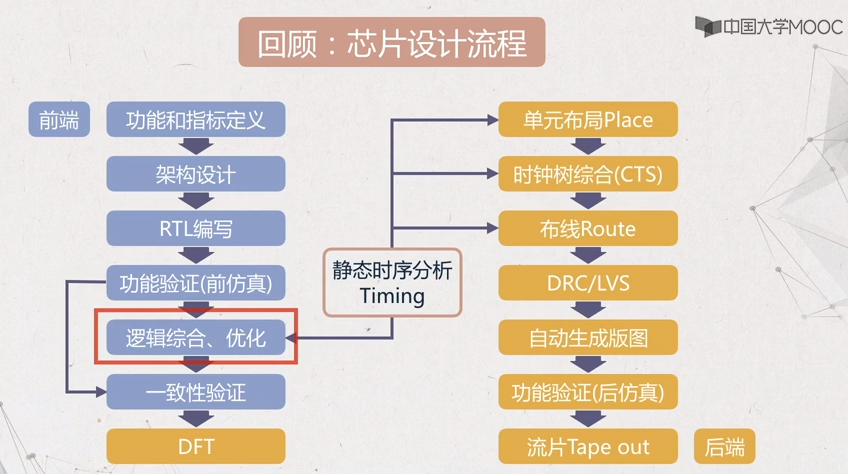
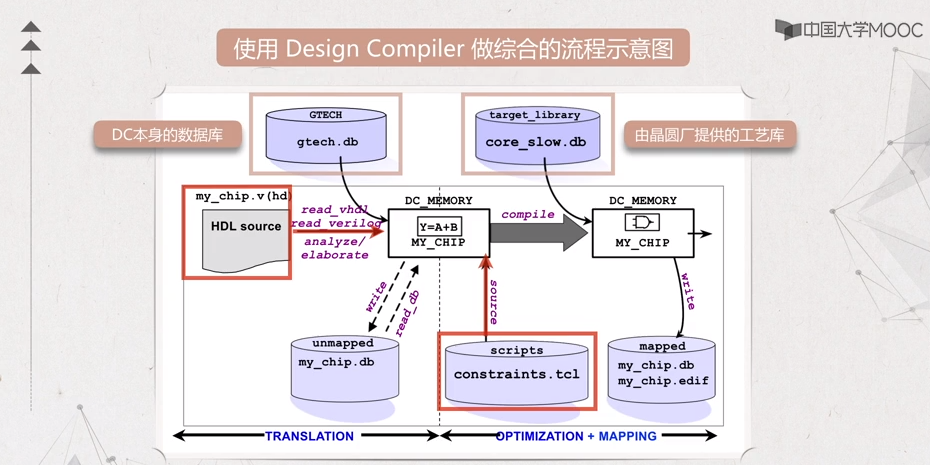
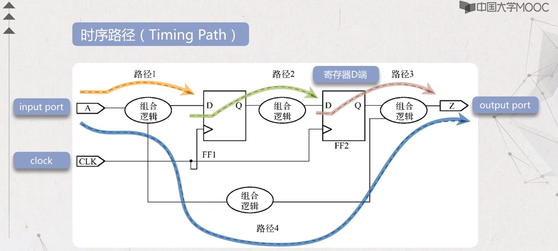

# Design Compiler Introduction

- [Design Compiler Introduction](#design-compiler-introduction)
  - [Goal](#goal)
  - [Recap: Chip design flow](#recap-chip-design-flow)
  - [Introduction](#introduction)
  - [3 Steps of logic synthesis](#3-steps-of-logic-synthesis)
  - [Design Objects](#design-objects)
  - [Timing path](#timing-path)
  - [Design Compiler Flow](#design-compiler-flow)

## Goal

1. Why logic synthesis
2. The basis of logic synthesis
3. What are the inputs for logic synthesis
4. How to add constraint
5. What are the outputs from logic synthesis

## Recap: Chip design flow



## Introduction

The process of logic synthesis is to convert the behavioral RTL code into gate level netlist.

The propose of logic synthesis: decide gate-level netlist, balance area and timing, balance timing and power, enhance the testability of the circuit.

## 3 Steps of logic synthesis

Synthesis = Translation + Optimization + Mapping

HDL source ==Translate==> Generic Boolean (GTECH) ==Optimize/Map==> Target Technology

- Translation

Translate the HDL source into an internal library file which is independent on the technology library

- Optimization

Optimize frequency, area, power based on constraint

- Mapping

Generate gate-level netlist with the target technology



## Design Objects

- Design: the design to be synthesised
- Port: the outer most ports of the design
- Clock
- Reference: a design module
- Cell: an instantiation of a Reference
- Pin: the pin of the cell
- Net: wire between pins

## Timing path



2 criteria for logic synthesis

- setup time
- hold time

## Design Compiler Flow

- Pre-synthesis Processes
- Constraining the Design
- Synthesizing the Design
- Post-synthesis Process

### Pre-synthesis Processes

- Design Compiler start
- Setup library files
- Create start scripts
- Read design files

### Start Design Compiler

4 ways to start DC

- design_vision: GUI
- design_analyzer: GUI
- dc_shell-t: tcl command line
- dc_shell: shell command line

Start dc_shell-t:

In shell terminal, enter `dc_shell-t` or run a script: `dc_shell-t -f script`

Start design_vision:

In shell terminal, enter `design_vision`

### Log files

- command.log: stores the commands and parameters used in DC
- view_command.log: stores the commands and parameters used in DC
- filenames.log: stores the path DC accessed including library and source files. Will be deleted when exiting DC

### Read Design file

Support 2 commands

- `read`
- `analyze`

#### read

- support different format: `.db`, `.v`, `.vhd`
- dcsh mode: use different argument for different files
- tcl mode: use different command for different files

Example:

```bash
read -format verilog[db, vhdl, etc] file    // dcsh mode
read_db file.db         // tcl mode
read_verilog file.v     // tcl mode
read_vhdl file.vhd      // tcl mode
```

#### analyze

- analyze: analyze HDL source code and store the intermediate file in `work` folder (user can specify the directory)
- elaborate: generate verilog module or VHDL entity from the intermediate file

analyze & elaborate allow user to check syntax error or convert HDL code before establishing GTECH

### Link

After reading all the modules to be synthesised, use `link` command to link all the modules or entities together.
