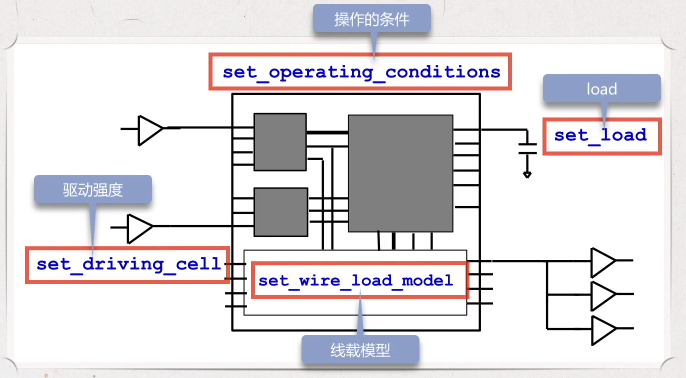
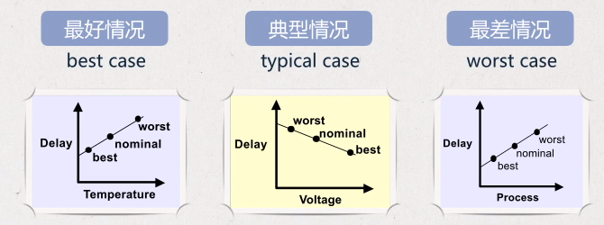
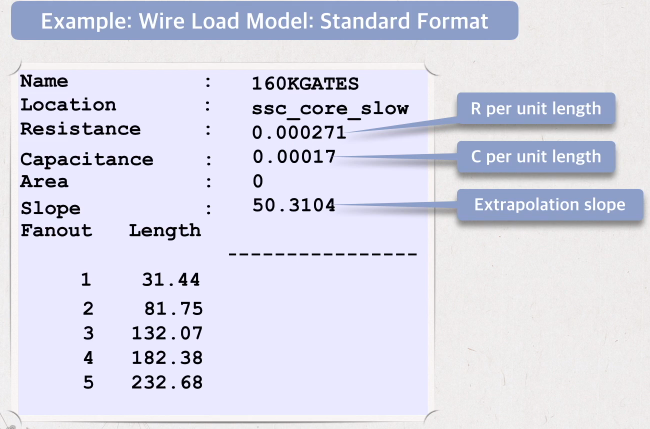
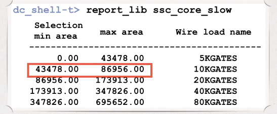
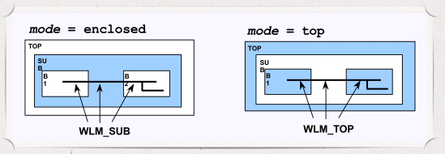

# Environment Constraint

- [Environment Constraint](#environment-constraint)
  - [Some missing constraints](#some-missing-constraints)
  - [Capacitive Load](#capacitive-load)
  - [Input Drive Strength](#input-drive-strength)
  - [Set environment](#set-environment)
  - [Net Delays (wire_load_model)](#net-delays-wire_load_model)
  - [Wireload Model mode](#wireload-model-mode)
  - [Check the constraint](#check-the-constraint)

## Some missing constraints

- The outside environment might change when we use the chip. For example: Power supply (VDD), temperature. These change will cause change on delay, so they should be consider in the design.
- The signal transition time is defined by the input/output driver and load.
- The internal wire connection is not considered.

We are now discussing how to add those constraints



## Capacitive Load

The output delay is affected by the load connected to the output. If the load is too heavy, it might affect the transition time and the timing

DC by default define the output load as 0, which can not represent the real working model. We can use `set_load` to specify a load value on an output port

```tcl
set_load 5 [get_ports OUT1]
```

Use `set_load load_of lib/cell/pin` to place the load of a gate from the technology library on the port

```tcl
set_load [load_of my_lib/and2a0/A] [get_ports OUT1]
set_load [expr [load_of my_lib/inv1a0/A] * 3] OUT1
```

## Input Drive Strength

In order to calculate input timing, DC need to know the transition time of an input port.

DC will assume the input transition time as 0. `set_driving_cell` allow user to defined a driving cell for an input, so DC can calculate an actual (non-zero) transition time.

```tcl
set_driving_cell -lib_cell and2a0 [get_ports IN1]
```

## Set environment

Environment includes: temperature, voltage, technology.

Once the working environment change, timing will be affected.

Delay is increased with increased temperature; delay is decreased with increased voltage; delay is increased with increased technology size.

Usually the technology library provided several operating condition model for the designer to choose from.



Usually synthesis considers 2 cases: worst case is used to analyze setup time, and best case is used to calculate hold time.

## Net Delays (wire_load_model)

During DC synthesis, the wire delay is calculated by wire load model

wire load model calculate its parasitic resistance and capacitance based on the fanout of the wire, given by the foundry.



Based on the fanout, search the table to get the wire length and then calculate the resistance and capacitance. If the fanout exceeds the value in the table, then DC will calculate the length based on the slope.

In each working condition, there are many different wire load model, and each model represents the connection under different design size. With smaller design size, the unit resistance and capacitance is smaller.

DC use `set_wire_load_model` to set wire load model

```tcl
set_wire_load_model -name 160KGATES
```

DC can automatically select the wire load model based on design size.



To turn off automatic wire load model selection, use `set auto_wire_load_selection false`

## Wireload Model mode

How does dc set wire_load_model between different module? There are 3 different mode: enclosed, top, segmented.



- Enclose: Use the wire_load_model from the enclosing module. (Use WLM from SUB)
- Top: Use the wire_load_model from the top level module. (Use WLM from TOP)
- Segmented: Use the wire_load_model from its own module and add all the segment together. (B1 + SUB + B2)

```tcl
set_wire_load_mode enclosed
```

## Check the constraint

- `check_timing`: check unconstrained timing path
- `check_design`: check unconnected ports
- `write_script`: write the constraint to a script and check