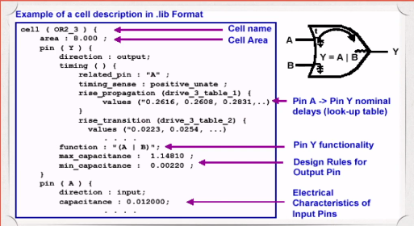

# Standard Cell Library Introduction

- [Standard Cell Library Introduction](#standard-cell-library-introduction)
  - [Library File](#library-file)
  - [Technology Files](#technology-files)
  - [Timing model for standard cell](#timing-model-for-standard-cell)
  - [Threshold Specification and Slew Derating](#threshold-specification-and-slew-derating)
  - [Timing model for combinational logic unit and sequential logic unit](#timing-model-for-combinational-logic-unit-and-sequential-logic-unit)

## Library File

Design Compiler need the following library file

- target_library
- link_library
- symbol_library
- synthetic_library

### target_library

target_library is the final technology that the gate-level netlist will be mapped to.

HDL code =>

- GTECH lib: Design Compiler internal exchange foramt
- Target lib: Generate optimized gate-level netlist

Target library is from Foundary usually with `.db` format.

Target library defines the following parameter for each gate level cells: **behavior, pins, area, timing, power**

DC uses the unit delay information given by target_library to calculate delay between the path. It chooses different cells based on delay, area, driving power to optimize the circuit.

General usage: within the same logic function, cells are switched to different size depending on **delay, area, power**

Command: `set target_library my_tech.db`



### link_library

Different between link library and target library

- Link library: Licensed IP, memory, IO, PAD
- Target library: standard cell

Link library defines the module or reference to be used in the design. It is specified in `link_library`.

`link_library` must include `*` so DC will first search the module/reference loaded in DC memory

`search_path` need to be specified for link library

### symbol_library

symbol_library defines the schematic for standard cell. It will be used in the circuit schematic. symbol_library is in `.sdb` format.

If symbol_library is not specified, DC will use the default symbol library.

### synthetic_library

DC Designware library.

Addition/Multiplication will be synthesised to an improved design.

## Technology Files

Technology files provide timing model for the cell unit.

### Timing arc for a simple inverter


Signals rising(falling) at the input port will cause falling(rising) at the output port.

Two delays:

- `Tr`: output rising delay
- `Tf`: output falling delay

Timing arc delays are measured based on the threshold defined in the standard cell library, usually 50% VDD

Timing arc delays usually depend on 2 factors

- Output capacitance load:
delay goes up with more output capacitance.
- Input signal transition time: delay goes up with long input transition time.

## Timing model for standard cell

Linear model and nonlinear model

### Linear model

The unit delay and output transition time are defined by a linear function with two parameter: input transition time and load capacitance.

```text
D = D0 + D1 * S + D2 * C
```

- D0, D1, D2: constant
- S: input transition time
- C: load capacitance

Linear model is not accurate at sub-microns

### Nonlinear model

Nonlinear timing model are represented by 2 dimensional: input transition time and output load capacitance

Example:


- pins and related_pin: timing arc between pins and related_pin
- cell_rise: rising delay model
- cell_fall: falling delay model
- delay_template_3x3: describe the type of the index and the order of the index


- The LUT defines the first variable as input transition time and the second variable as load capacitance.
- Each variable has 3 entry so it represents a 3x3 table.
- In most of the cases, the item for the table are tabulated. The first index can be treated as row index, the second index is column index. The indexed value is a placeholder with virtual value. They will be replaced by the actual value in cell_fall and cell_rise delay table.
- Another method is to define the indexed value in the template instead of defining them in cell_rise and cell_fall.

## Threshold Specification and Slew Derating

Slew is based the measurement threshold defined in the library

Most library (> 0.25u) use 10% and 90% as the measurement threshold. The transition waveform are treated as linear between the measurement threshold.

With better technology, the most linear part of the actual waveform usually resides between 30% and 70%. Most of the recent library defines 30% and 70% Vdd as measurement threshold.

Because the previous measurement is defined between 10% and 90%, when filling up the library, the measured transition time is doubled compared the time using 30% and 70% measurement point.

### Transition derate factor

- Usually defied as 0.5. Measurement threshold is 30% and 70%
- Slew Derating decrease to 0.5, making the equivalent measurement threshold as 10% and 90%

Example 1:


slew_derate_from_library is 0.5, so the transition time should be multiplied by 0.5 in order to achieve the same transition time as transition threshold (30-70)

This means the value defined in the transition table is actually measured from (10-90)

Example 2:


transition threshold is 20-80 and no slew_derate_from_library defined (default value is 1.0). Meaning the value defined in the transition table is the actual value defined by (20-80)

Example 3:


slew_derate_from_library is 0.6 the transition threshold is 20-80, meaning the value defined in the table is measured with (0-100). `((80 - 20) / (100 - 0)) = 0.6`

When derate is defined the transition time used for delay calculation is: `library_transition_time_value * slew_derate`

## Timing model for combinational logic unit and sequential logic unit

### combinational cell

Example:


In this example there are 4 timing arc.

### sequential cell

Example:


- D pin: Setup/Hold (both rising/falling)
- CDN pin: Recovery/Removal
- CK pin: Prop delay(clk-to-q delay) (both rising/falling)