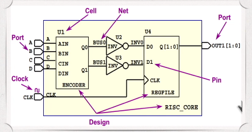

# TCL language

- [TCL language](#tcl-language)
  - [Introduction](#introduction)
  - [Example TCL command](#example-tcl-command)
  - [get_ports](#get_ports)
  - [get_pins](#get_pins)
  - [get_nets](#get_nets)
  - [Attribute](#attribute)

## Introduction

TCL = Tool Command Language

Tcl script are based on commands

- Built-in commands: provided by the Tcl interpreter itself
- Application Commands: proveidedj by Synopsys tools, written as a command procedure in C or C++ using the Tcl extension mechanism
- Used defined commands: provided by used, written as command procedure in Tcl

## Example TCL command



## get_ports

```tcl
get_ports portsName
```

Return the ports object in the design.

- Check if there is a port called CLK

```tcl
$ get_ports CLK
{CLK}
```

- Check if there is a port called SPI

```tcl
$ get_ports SPI
No object Found!
```

- Check all the ports in the design (* is the wildcard)

```tcl
$ get_ports *
{A B C D CLK OUTp[0] OUT[1]}
```

- Get port starting with C

```tcl
$ get_ports C*
```

## get_pins

```tcl
get_pins pinsName
```

Recap: what is reference name (ref_name) and what is instance name?

- Check if there is a cell called U4?

```tcl
$ get_cells U4
{U4}
```

- Check all the cells in design

```tcl
$ get_cells *
```

- Check all the cells end with 3

```tcl
$ get_cells *3
```

## get_nets

```tcl
get_nets netsName
```

- Check all the nets

```tcl
$ get_nets *
```

- Check the net number in the design

```tcl
$ llength [get_object_name [get_nets *]]
Or
$ sizeof_collection [get_nets *]
```

## Attribute

There are 4 common object in design: cell, net, port, pin and each object has its own attribute.

- Each attribute can be obtained through `get_attribute` command
- `list_attribute -class *` gets all the object attributes.
- some attribute can be set through `set_attribute`

### Cell object attribute

- ref_name: store the reference cell name

```get_attribute [get_cells -h U3] ref_name```

### Pin object attribute

- owner_net: store the net connected to it

```get_attribute [get_pins U2/A] owner_net```

### Port object attribute

- direction: store the port direction

```get_attribute [get_ports A] direction```

### Net object attribute

- full_name: store the net name

```get_attribute [get_ports INV0] full_name```

### More with attribute - get_* -f

```get_* -f```

`-f` can be used to filter attribute to get the object we want

Example 1: get all the input ports

```get_ports * -f "direction==in"```

Example 2: get output output port

```get_ports * -f "direction==out"```

Example 3: get all the cell with ref_name being INV

```get_cells * -f "ref_name==INV"```

### More with attribute - get_* [object] -of

```get_* [object] -of```

`-of` can be used to get the object connected to the object you specified.

port object <-> net object

```get_nets -of [get_ports A]```

net object <-> port object/pin object

```get_nets -of [get_pin U2/A]```

pin object <-> net object

```get_pin -of [get_net INV1]```

cell object <-> pin object

```get_pin -of [get_cell U4]```