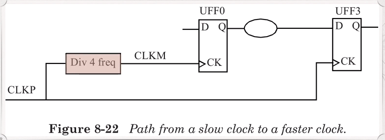
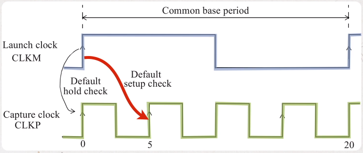
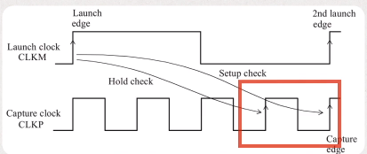
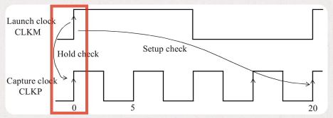
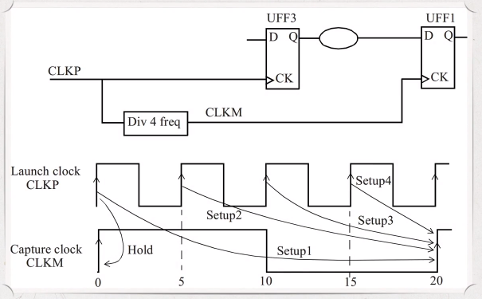
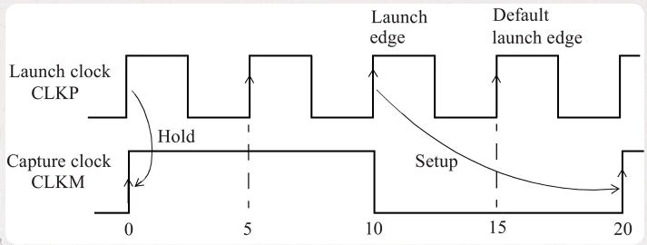

# Fast and Sl;w clock

- [Fast and Sl;w clock](#fast-and-slw-clock)
  - [Slow to fast clock Domains](#slow-to-fast-clock-domains)
  - [Fast to slow clock](#fast-to-slow-clock)

## Slow to fast clock Domains



- When the clock frequencies are different for launch flip-flop and the capture flip-flop, STA is performed by first determining a common base period.
- The faster clock is expanded so that a common period is obtained.



In the above example, we can see that the launch data is available every fourth cycle of the capture clock.

Let us assume that the intention is not to capture data on the very next active edge of CLKP, but to capture on every 4th capture edge. This assumption gives the combinational logic between the flip-flops four period of CLKP to propagate, which is 20ns.

We can do this by setting the follow multi-cycle specification:

```tcl
set_multicycle_path 4 -setup -from [get_clocks CLKM] -to [get_clocks CLKP] -end
```

The -end specifies that the multi-cycle of 4 refer to the end point or the capture clock. This multicycle specification changes the setup and hold checks to the ones shown below:



Note that the hold check is derived from the setup check and defaults to one cycle preceding the intended capture edge.

In the most designs, this is not the intended clock, and the hold check should be moved all the way back to where the launch edge is. We do this by setting a hold multicycle specification of 3.

```tcl
set_multicycle_path 3 -hold -from [get_clocks CLKM] -to [get_clocks CLKP] -end
```

The cycle of 3 moves the hold checking edge back 3 cycles, that is, to time 0ns. The distinction with a setup multicyicle is that in setup, the setup capture edge moves forward by the specified number of cycles from the default setup capture edge; in a hold multicycle, the hold check edge moves backward from the default hold check edge (one cycle before setup edge).



In summary, if a setup multicycle of N cycles is specified, then most likely a hold multicycle of N-1 cycle should also be specified. A good rule of thumb for multi-frequency multicycle path specification in the case of paths between slow to fast clock domains is to use the `-end` option. With this option, the setup and hold checks are adjusted based on the clock cycles of the fast clock.

## Fast to slow clock



There are 4 setup timing checks possible. However, the most restrictive one is the setup4 check.

Similar to the setup checks, there are 4 hold checks possible.

____



In general, a designer may specify the data path from the fast clock to the slow clock to be a multicycle path. If the setup check is relaxed to provide 2 cycles of the fast clock for the data path, the following is included for this multicycle specification.

```tcl
set_multicycle_path 2 -setup -from [get_clocks CLKP] -to [get_clocks CLKM] -start
set_multicycle_path 1 -hold -from [get_clocks CLKP] -to [get_clocks CLKM] -start
```

The `-start` option refers to the launch clock and is the default for a multicycle hold
