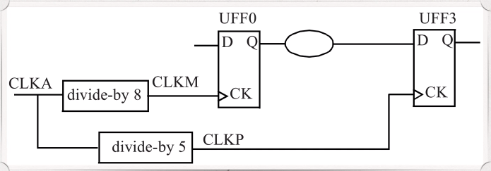
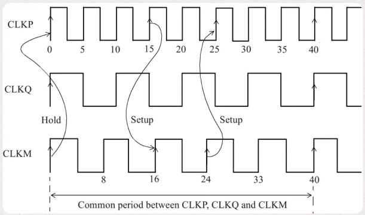
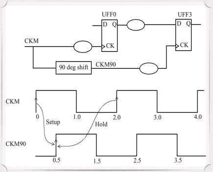
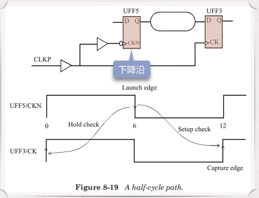

# Multiple Clocks

- [Multiple Clocks](#multiple-clocks)
  - [Integer Multiplies](#integer-multiplies)
  - [Non-integer multiples](#non-integer-multiples)
  - [Phase shifted](#phase-shifted)
  - [Half-cycle paths](#half-cycle-paths)
  - [False paths](#false-paths)

## Integer Multiplies

Often there are multiple clocks defined in a design with frequencies that are simple (or integer multiples of each other.)

In such cases, STA is performed by computing a common base period among all related clocks (two clocks are related if they have a data path between their domains). The common base period is established so that all clocks are synchronized.

## Non-integer multiples



```tcl
create_clock -name CLKM -period 8 -waveform {0 4} [get_ports CLKM]
create_clock -name CLKQ -period 10 -waveform {0 5}
create_clock -name CLKP -period 5 -waveform {0 2.5} [get_ports CLKP]
```

The setup check occurs over the minimum time between the launch edge and the capture edge of the clock.

Note that the common period is found only for related clocks (that is, clocks that have timing paths between them.)



Now we examine the setup path from the CLKP clock domain to the CLKM clock domain. In this case, the most restrictive setup path is from a launch edge at 15ns of clock CLKP to the capture edge at 16ns of clock CLKM.

## Phase shifted

Here is an example where 2 clocks are ninety degrees phase-shifted with respect to each other



```tcl
create_clock -period 2.0 -waveform {0 1.0} [get_ports CLKM]
create_clock -period 2.0 -waveform {0.5 1.5} [get_ports CLKM90]
```

## Half-cycle paths

If a design has both negative-edge triggered flip-flops (active edge is falling edge) and positive-edge triggered flip-flops (active edge clock edge is rising edge), it is likely that half-cycle paths exist in the design. A half-cycle path could be from a rising edge FF to a falling edge FF, or vise versa.



## False paths

It is possible that certain timing pats are not real (or not possible) in the actual functional operation of the design. Such path can be turned off during STA by setting these as false paths. A false path is ignored by the STA for analysis.

False path can be the following path

- From one clock domain to another clock domain
- From a clock pin of a FF to the input of another fF
- Through a pin of a cell

When a false path is specified through a pin of a cell, all paths that go through that pin are ignored for timing analysis. The advantage of identifying the false paths is that the analysis space is reduced, thereby allowing the analysis to focus only on the real paths. This helps cut down the analysis time as well. However, too many false paths which are wildcarded using the through specification can slow down the analysis.

A false path is set using the `set_false_path` specification. Here are some examples.

```tcl
set_false_path -from [get_clocks CLK] -to [get_clocks CORE_CLK]
set_false_path -through [get_pins UMUXO/S]
```
