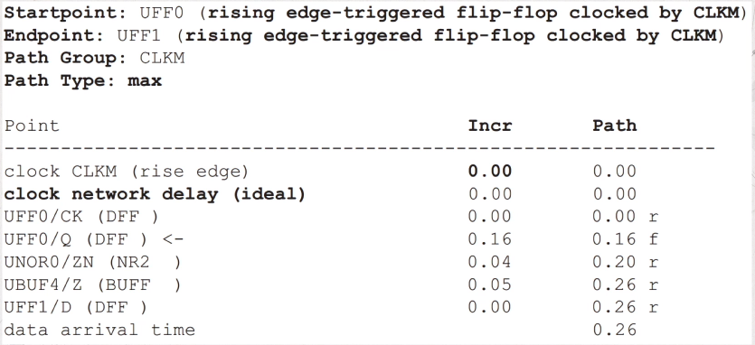
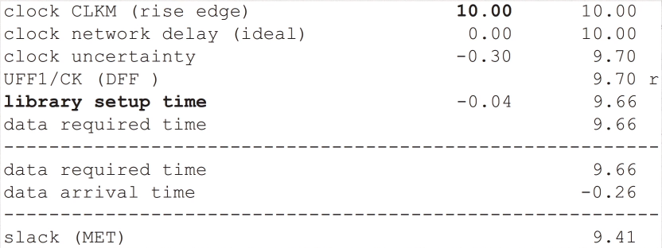
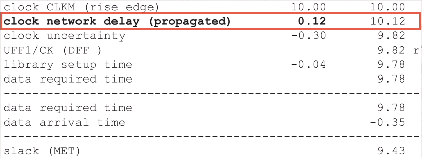
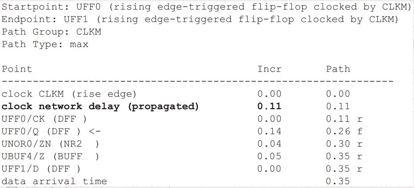
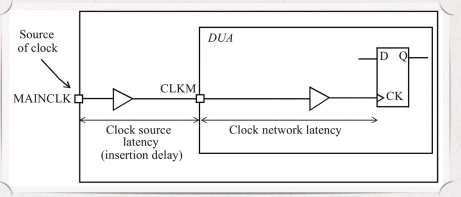

# Register to Register path for single clock

- [Register to Register path for single clock](#register-to-register-path-for-single-clock)
  - [FF to FF path](#ff-to-ff-path)
  - [Slack](#slack)
  - [Clock source latency](#clock-source-latency)

## FF to FF path

Example timing report:

Launching path



Capturing path



4 Questions:

1. What are the start point and the end point of this path?
2. Which path group is this path belong to?
3. Path type?
4. Constraint?

## Slack

T<sub>launch</sub> + T<sub>ck2q</sub> + T<sub>dp</sub> < T<sub>capture</sub> + T<sub>cycle</sub> -T<sub>setup</sub>

Slack = (T<sub>capture</sub> + T<sub>cycle</sub> -T<sub>setup</sub> - T<sub>uncertainty</sub>) - (T<sub>launch</sub> + T<sub>ck2q</sub> + T<sub>dp</sub>)

T<sub>uncertainty</sub> : clock uncertainty

In the above timing report, the clock network is treated as ideal clock network so there is no latency on clock path.

Here is an example with actual clock:





Here clock network delay != 0

The "r" and "f" characters in the timing report indicate the rising and falling edge of the clock or data signal. For each cell rising edge and falling edge delay may be different. PT will use the bigger one in STA

## Clock source latency

This is also called insertion delay and is the time it takes for a clock to propagate from its source to the clock definition point of the design under analysis as depicted in the figure. This corresponds to the latency of the clock tree that is outside of the design.



This latency can be explicitly specified using the `set_clock_latency` command.

```tcl
set_clock_latency -source -rise 0.7 [get_clocks CLKM]
set_clock_latency -source -fall 0.65 [get_clocks CLKM]
```