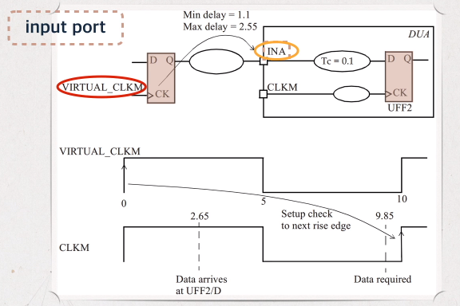

# Setup and hold check for single clock

- [Setup and hold check for single clock](#setup-and-hold-check-for-single-clock)
  - [Input to FF path](#input-to-ff-path)
  - [FF to output path](#ff-to-output-path)
  - [Input to output path](#input-to-output-path)
  - [Hold time check](#hold-time-check)

## Input to FF path



Constraint:

Assume a virtual clock for FF outside the module.

```tcl
create_clock -name VIRTUAL_CLKM -period -waveform {0 5}
set_input_delay -clock VIRTUAL_CLKM -max 2.55 [get_ports INA]
```

## FF to output path


To determine the delay of the last cell connected to the output port correctly, one needs to specify the load on the port. The output load is specified using the `set_load` command.

```tcl
set_output_delay -clock VIRTUAL_CLKP -max 5.1 [get_ports ROUT]
set_load 0.02 [get_ports ROUT]
```

## Input to output path


```tcl
set_input_delay -clock VIRTUAL_CLKM -max 3.6 [get_ports INB]
set_input_delay -clock VIRTUAL_CLKM -max 5.8 [get_ports POUT]
```

## Hold time check

The hold check is from one active edge of the clock in the launch flip-flop to the same clock edge at the capture flip-flop.

Thus, a hold check is independent of the clock period.

The hold check is carried out on each active edge of the clock of the capture flip-flop.


The hold check can be mathematically expressed as:

T<sub>launch</sub> + T<sub>ck2q</sub> + T<sub>dp</sub> > T<sub>capture</sub> + T<sub>hold</sub>