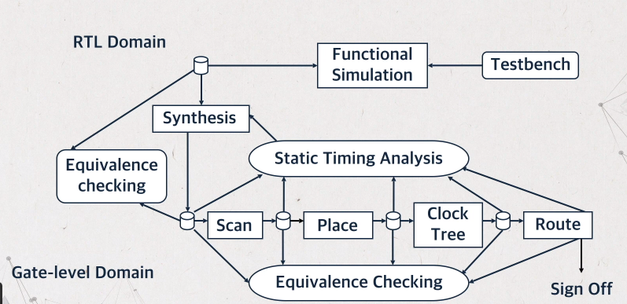
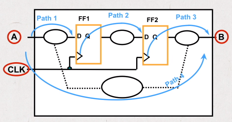
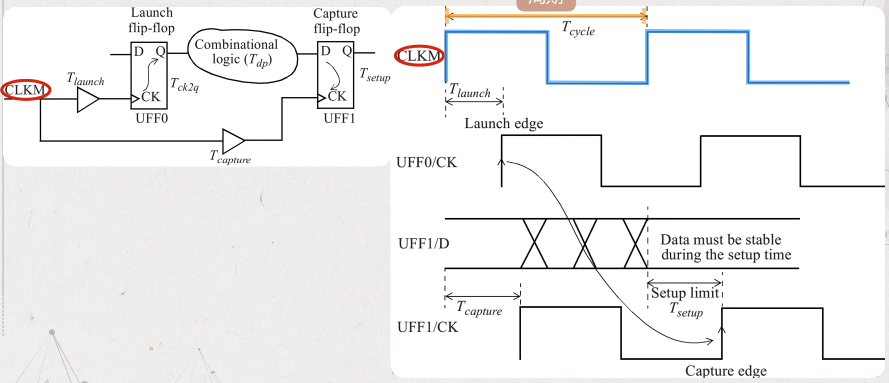

# STA Introduction

- [STA Introduction](#sta-introduction)
  - [Introduction](#introduction)
  - [Basic concept](#basic-concept)
  - [Three steps in STA](#three-steps-in-sta)
  - [Timing path](#timing-path)
  - [Setup timing check](#setup-timing-check)

## Introduction

What is Static Timing Analysis??

STA is a method for determining if a circuit meets timing constraints without having to simulate:

- Much faster then timing-driven, gate-level simulation
- Proper circuit functionality is not checked
- Vector generation NOT required

### STA flow

STA vs Simulation

|                        | Event Driven Timing simulation                 | STA                                                                                                        |
| ---------------------- | ---------------------------------------------- | ---------------------------------------------------------------------------------------------------------- |
| Vector Generation      | Required                                       | Not Required                                                                                               |
| Design Coverage        | Vector dependent (limited) coverage            | Vector independent exhaustive coverage                                                                     |
| Runtime                | Takes several days/weeks of CPU time           | Analyzes multimillion gate design in hours                                                                 |
| Capacity               | Can run out of memory for multimillion designs | Can easily handle multimillion design                                                                      |
| Analysis/Debug feature | no special features for timing analysis        | Features such as min/mux analysis, on chip variant, dynamic loop breaking case efforts for timing analysis |
| Design style support   | No Restrictions                                | Limited support for asynchronous design styles                                                             |

## Basic concept

Setup time: The length of time that data must stabilize before the clock transition.

Hold time: The length of time that data must remain stable at the input pin after the active clock transition.

Time slack: slacks is used to describe how much of the budget did the logic used up.

Slack - the resulting margin between required & actual time of signal traveling in the path.

- positive slack or zero means meet constraints
- negative slack means violate constraint

Speed vs Slack: The worst case logic path determine the maximum speed (minimum clock period) for a synchronous system

Power vs slack

## Three steps in STA

STA involves three main steps:

1. Design is broken down into sets of timing paths
2. Delay of each path is calculated
3. Path delays are checked to see if timing constraints have been met

## Timing path

PrimeTime breaks designs into sets of paths. There are 4 types of PrimeTime paths:

- Input port to data pin of FF (path 1)
- Clock pin of FF to data in of FF (path 2)
- Clock pin of FF to output port (path 3)
- Input port to output port (path 4)

## Setup timing check

A setup timing check verifies the timing relationship between the clock and the data pin of a flip-flop so that the setup requirement is met.

The setup check can be mathematically expressed as:
Tlaunch + Tck2q + Tdp < Tcapture + Tcycle -Tsetup

- Tlaunch : the delay of the clock tree of the launch flip-flop
- Tdp : the delay of combinational logic data path
- Tcycle : clock period
- Tcapture : the delay of the clock tree for the capture flip-flop