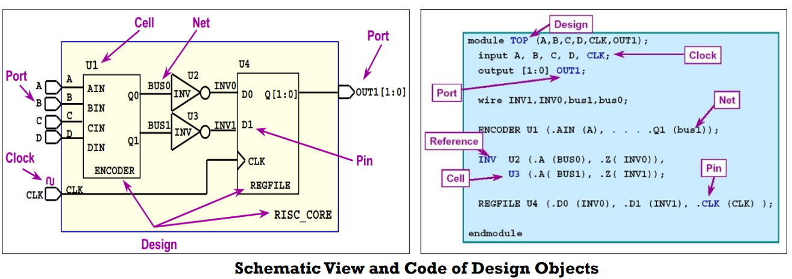

# Synopsys TCL

[TOC]

## 综合软件当中TCL的常见指令



### get_ports

- 语法格式：`get_ports portsName`
- 指令功能: 返回design中对应的ports object 

### get_cells 

- 语法格式：`get_cells cellsName` 
- 指令功能：返回design中对应的cell的instance name object

回顾几个概念：

- 什么是reference name(ref_name)?

  {ENCODER INV REGFILE}

- 什么是instance name?

  {U1 U2 U3 U4}

### get_nets

- 语法格式：`get_nets netsName` 
- 指令功能：返回design中net的object

### get_pins

- 语法格式：`get_pins pinsName` 
- 指令功能：返回design中pin的object


## “数据类型：object （对象）” 与其 “属性”

- object是对于tcl脚本一个重要的扩展
- 常见的对象有四种 cell, net, port, pin；
- 每种object有它的属性。

下面的ppt将介绍一些常见属性。

- 任何一个属性都可以用get_attribute得到
- list_attribute –class * 可以得到所有object 的属性
- 部分属性可以用set_attribute来设置

**Cell object**

属性 ref_name : 用来保存其map到的reference cell名称

**Pin Object**

属性 owner_net : 用来保存与之相连的net的名称

**Port object**

属性 direction : 用来保存port 的方向

**Net object**

属性 full_name : 用来保存net的名称

理解了属性，就能做更多的事情

### get_* -f

​	-f 这个option可以用来过滤属性，以得到我们想要的object

例子-1： 想得到所有方向是input的port 

```tcl
Shell> get_ports * –f “direction==in” {A B C D CLK}
```

### get_* [object] -of

​	-of 这个option可以用来得到与你指定object相连接的object

object的连接关系:

--port object <-> net object

```tcl
> get_nets –of [get_port A]
```

--net object <-> port object / pin object

```tc;
> get_net –of [get_pin U2/A]
```

--pin object <-> net object

```tcl
> get_pin -of [get_net INV1]
```

--cell object <-> pin object

```tcl
>get_pins –of [get_cell U4]
```


## Reference

- Using Tcl with SynopsysTools
- PrimeTime User Guide: Fundamentals
- PrimeTime User Guide: Advanced Timing Analysis

