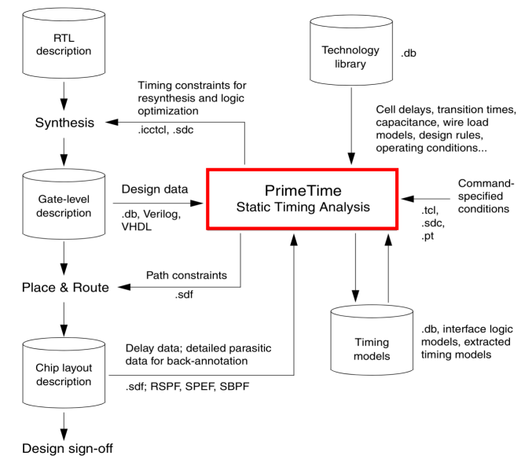
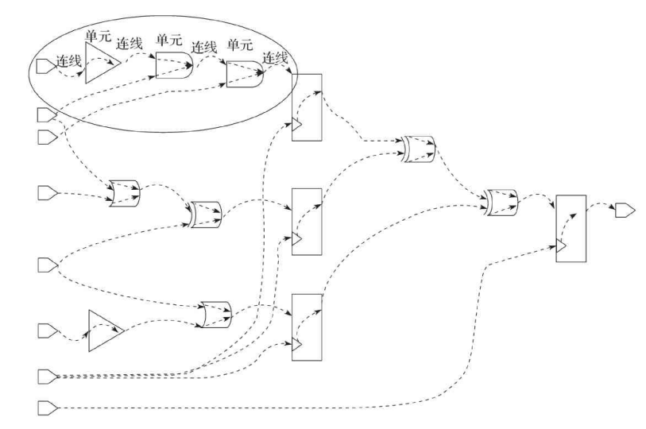
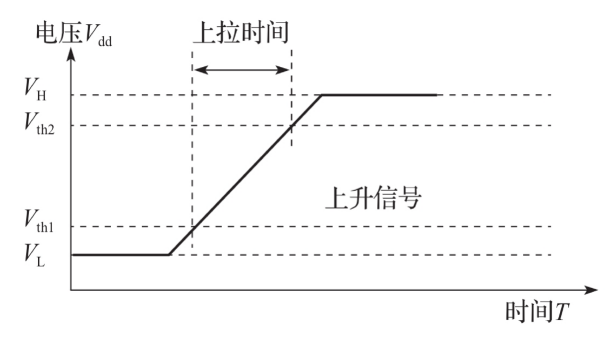
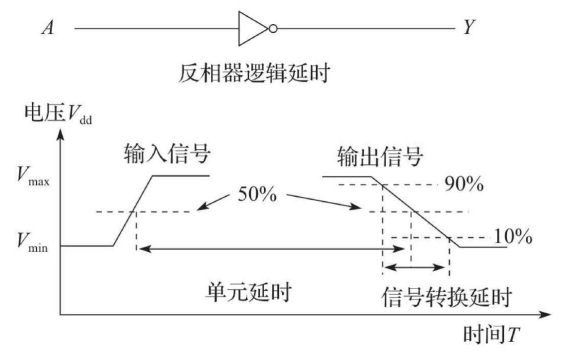
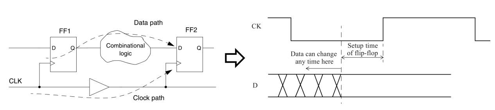
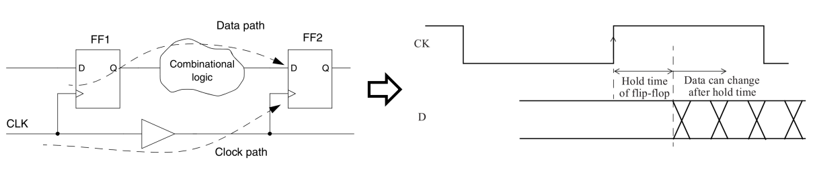
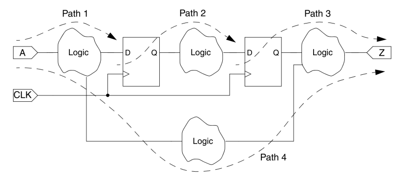
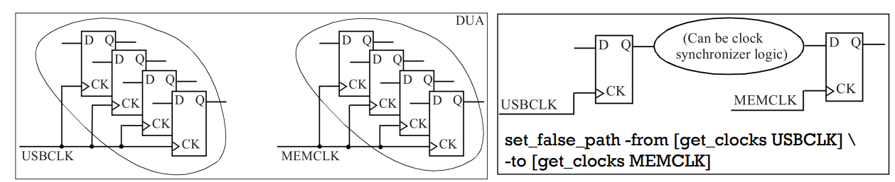
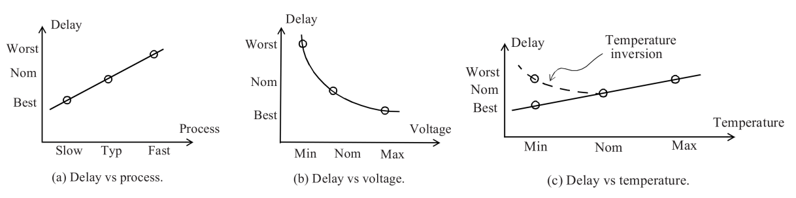

# STA 基本概念

[TOC]

## PrimeTime



## STA Concepts

### Timing Arc



### Cell delay

1. Transition delay



2. Logic gate delay

   

### Setup time and hold time

#### Setup time

- A setup constraint specifies how much time is necessary for data to be available at the input of a sequential device **before** the clock edge that captures the data in the device.

- This constraint enforces a **maximum** delay on the data path relative to the clock path.



#### Hold time

- A hold constraint specifies how much time is necessary for data to be stable at the input of a sequential device **after** the clock edge that captures the data in the device.
- This constraint enforces a **minimum** delay on the data path relative to the clock path.



### Timing path

The first step performed by PrimeTime for timing analysis is to break the design down into **a set of timing paths**.



Each path has **a** **startpoint** and **an** **endpoint**.

The **startpoint** of a path is **a clock pin** of a sequential element, or possibly **an input port** of the design (because the input data can be launched from some external source).

The **endpoint** of a path is **a data input pin** of a sequential element, or possibly **an output port** of the design (because the output data can be captured by some external sink).

### Clock Domains

The set of flip-flops being fed by one clock is called its clock domain. 



### Operating Conditions

- Static timing analysis is typically performed at a specific operating condition.
- An operating condition is defined as a combination of Process, Voltage and Temperature (PVT).
- Cell delays and interconnect delays are computed based upon the specified operating condition.
- There are three kinds of manufacturing process models that are provided by the semiconductor foundry for digital designs: **slow** process models, **typical** process models, and **fast** process models.
- The slow and fast process models represent the extreme corners of the manufacturing process of a foundry.
- For robust design, the design is validated at the extreme corners of the manufacturing process as well as environment extremes for temperature and power supply



It is important to decide the operating conditions that should be used for various static timing analyses.

The choice of what operating condition to use for STA is also governed by the operating conditions under which cell libraries are available. Three standard operating conditions are:

- WCS (Worst-Case Slow): Process is slow, temperature is highest (say 125C) and voltage is lowest (say nominal 1.2V minus 10%).
- TYP (Typical): Process is typical, temperature is nominal (say 25C) and voltage is nominal (say 1.2V).
- BCF (Best-Case Fast): Process is fast, temperature is lowest (say -40C) and voltage is highest (say nominal 1.2V plus 10%).

```tcl
set_operating_conditions “WCCOM” -library mychip
# Use the operating condition called WCCOM defined in the cell library mychip.
```

