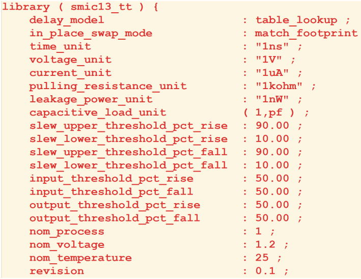
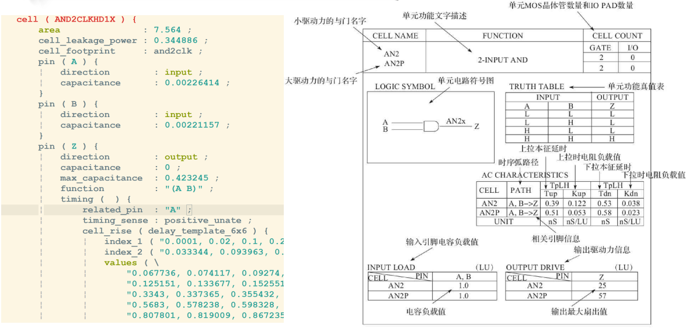
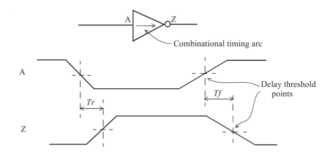
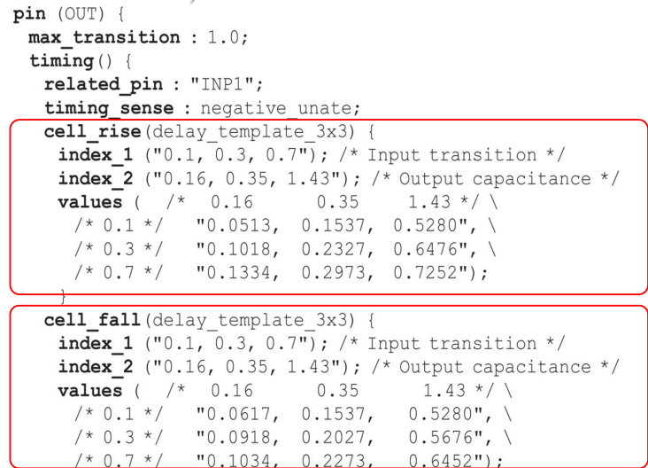
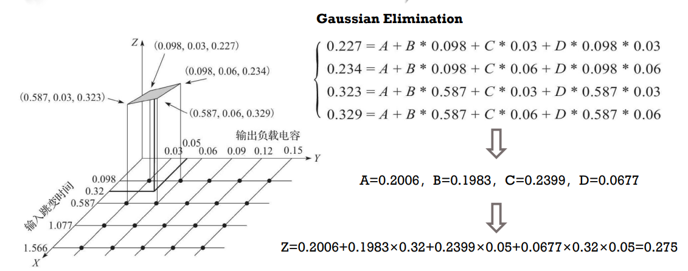
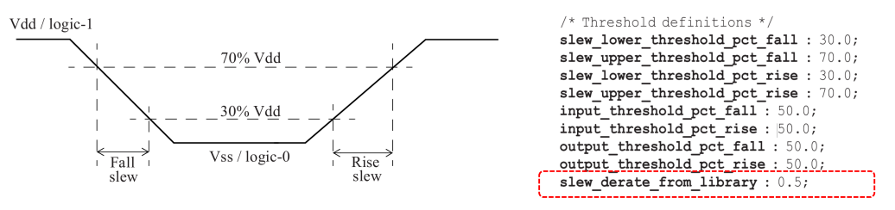
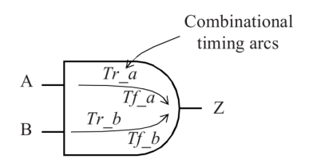
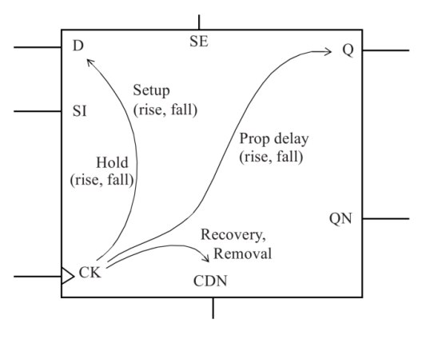

# Standard Cell Library

[TOC]

## Overview of Synopsys Timing Lib






## Non-Linear Delay Model

### Timing Model

Let us first consider timing arcs for a simple inverter logic. Since it is an inverter, a rising (falling) transition at the input causes a falling (rising) transition at the output.



The two kinds of delay characterized for the cell are:

- Tr: Output rise delay
- Tf: Output fall delay

Notice that the delays are measured based upon the threshold points defined in a cell ibrary, which is typically 50% Vdd.

The delay for the timing arc through the inverter cell is dependent on two factors:

1. the **output load**, that is, the capacitance load at the output pin of the inverter, and
2. the **transition time** of the signal at the input.

The delay values have a direct correlation with the load capacitance - *the larger the load capacitance, the larger the delay*. 

In most cases, *the delay increases with increasing input transition time.*

### Linear Timing Model

A simple timing model is a linear delay model, where the delay and the output transition time of the cell are represented as linear functions of the two parameters: input transition time and the output load capacitance.

The general form of the linear model for the delay, D, through the cell is illustrated below.

```
D = D0 + D1 * S + D2 * C
```

where D0, D1, D2 are constants, S is the input transition time, and C is the output load capacitance.

The linear delay models are not accurate over the range of input transition time and output capacitance for submicron technologies, and thus most cell libraries presently use the more complex models such as the non-linear delay model.

### Non-Linear Delay Model

Most of the cell libraries include **table models** to specify the delays and timing checks for various timing arcs of the cell.

- The table models are referred to as NLDM (Non-Linear Delay Model) and are used for delay, output slew, or other timing checks.

- The table models capture the delay through the cell for various combinations of input transition time at the cell input pin and total output capacitance at the cell output.

An NLDM model for delay is presented in a two-dimensional form.

The two independent variables being the **input transition time** and the **output load capacitance**, and the entries in the table denoting the **delay**

Here is an example of such a table for a typical inverter cell:



There are separate models for the rise and fall delays (for the output pin) and these are labeled as cell_rise and cell_fall respectively.

The type of indices and the order of table lookup indices are described in the lookup table template delay_template_3x3.

The example below corresponds to a general case where the lookup does not correspond to any of the entries available in the table. In such cases, *two-dimensional interpolation is utilized to provide the resulting timing value*. The two *nearest* table indices in each dimension are chosen for the table interpolation.




## Threshold Specifications and Slew Derating

The slew 1 values are based upon the measurement thresholds specified in the library. Most of the previous generation libraries (0.25?m or older) used 10% and 90% as measurement thresholds for slew or transition time.

The slew thresholds are chosen to correspond to the linear portion of the waveform. As technology becomes finer, the portion where the actual waveform is most linear is typically between 30% and 70% points.

**Thus, most of the newer generation timing libraries specify slew measurement points as 30% and 70% of Vdd.**

However, because the transition times were previously measured between 10% and 90%, the transition times measured between 30% and 70% are usually doubled for populating the library. This is specified by the slew derate factor which is typically specified as 0.5.

The slew thresholds of 30% and 70% with slew derate as 0.5 results in equivalent measurement points of 10% and 90%. An example settings of threshold is illustrated below.



The above settings specify that the transition times in the library tables have to be multiplied by 0.5 to obtain the transition times which correspond to the slew threshold (30-70) settings.

This means that the values in the transition tables (as well as corresponding index values) are effectively 10-90 values.

During characterization, the transition is measured at 30-70 and the transition data in the library corresponds to extrapolation of measured values to 10% to 90% ((70 - 30)/(90 - 10) = 0.5).

When slew derating is specified, the slew value internally used during delay calculation is:

```
library_transition_time_value * slew_derate
```

This is the slew used internally by the delay calculation tool and corresponds to the characterized slew threshold measurement points.


## Timing Model

### Combinational Cells

Let us consider the timing arcs for a two-input and cell. Both the timing arcs for this cell are positive_unate; therefore an input pin rise corresponds to an output rise and vice versa.



This implies that for the NLDM model, there would be four table models for specifying delays. Similarly, there would be four such table models for specifying the output transition times as well.

### Sequential Cells



 The propagation delay of a sequential cell is from the active edge of the clock to a rising or falling edge on the output.


## Wireload Models

