# STA Environment

[TOC]

## What is STA Environment

Specification of correct constraints is important in analyzing STA results.

The design environment should be specified accurately so that STA analysis can identify all the timing issues in the design.

Preparing for STA involves amongst others, setting up clocks, specifying IO timing characteristics, and specifying false paths and multicycle paths.

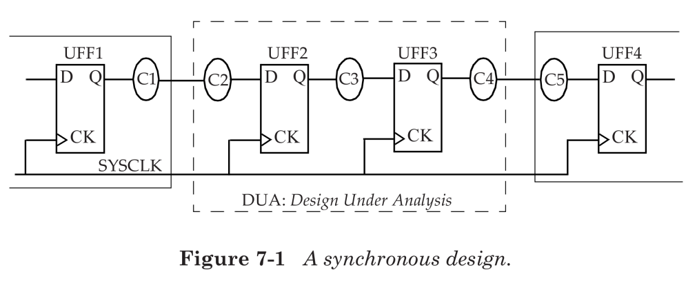


## Specifying Clocks

To define a clock, we need to provide the following information:

1. **Clock source**: it can be a port of the design, or be a pin of a cell inside the design (typically that is part of a clock generation logic).
2. **Period**: the time period of the clock.
3. **Duty cycle**: the high duration (positive phase) and the low duration (negative phase).
4. **Edge times**: the times for the rising edge and the falling edge.

Examples:

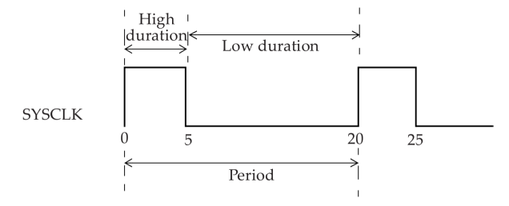

```tcl
create_clock -name SYSCLK -period 20 -waveform {0 5} [get_ports SCLK]
```

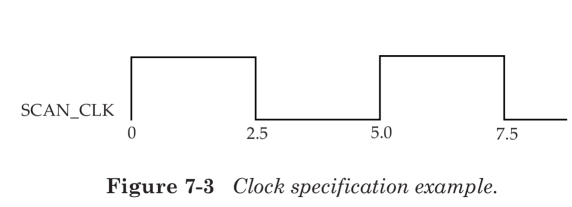

```tcl
create_clock -name SCAN_CLK -period 5 [get_ports SCAN_CLK]
```

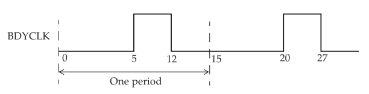

```tcl
create_clock -name BDYCLK -period 15 -waveform {5 12} [get_ports GBLCLK]
```

### Clock Uncertainty

The timing uncertainty of a clock period can be specified using the **set_clock_uncertainty** specification.

The uncertainty can be used to model various factors that can reduce the effective clock period.

These factors can be the **clock jitter** and **any other pessimism** that one may want to include for timing analysis.

Example:

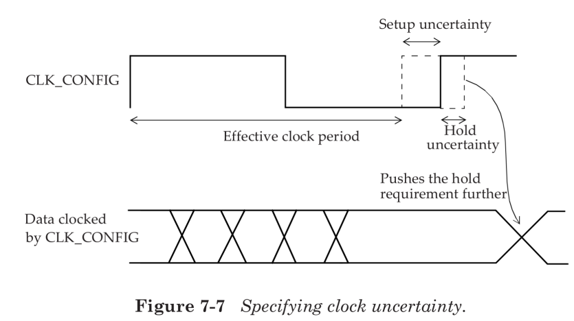

```tcl
set_clock_uncertainty -setup 0.2 [get_clocks CLK_CONFIG]
set_clock_uncertainty -hold 0.05 [get_clocks CLK_CONFIG]
```

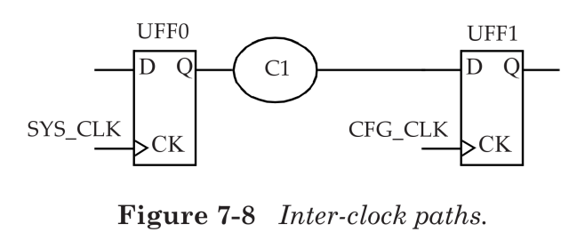

```tcl
set_clock_uncertainty -from VIRTUAL_SYS_CLK to SYS_CLK -hold 0.05
set_clock_uncertainty -from VIRTUAL_SYS_CLK to SYS_CLK -setup 0.4
set_clock_uncertainty -from SYS_CLK to CFG_CLK -hold 0.05
set_clock_uncertainty -from SYS_CLK to CFG_CLK -setup 0.1
```

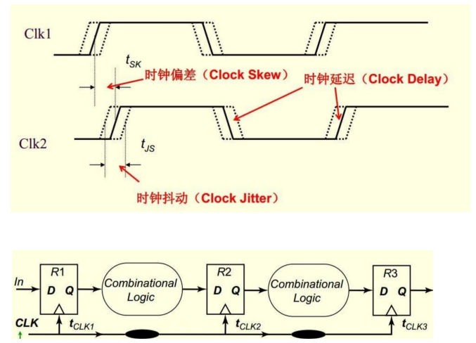

### Clock Latency

There are two types of clock latencies: **network latency** and **source latency**.

**Network latency** is the delay from the clock definition point (create_clock) to the clock pin of a flip-flop.

**Source latency**, also called insertion delay, is the delay from the clock source to the clock definition point.

Source latency could represent either on-chip or off-chip latency. The total clock latency at the clock pin of a flip-flop is the sum of the source and network latencies.

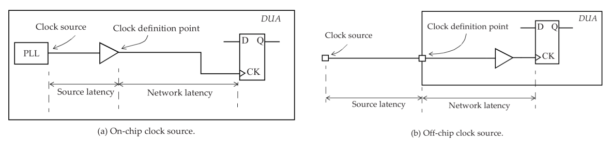

```tcl
# Specify a network latency (no -source option) of 0.8ns for rise, fall, max and min:
set_clock_latency 0.8 [get_clocks CLK_CONFIG]
# Specify a source latency:
set_clock_latency 1.9 -source [get_clocks SYS_CLk]
# Specify a min source latency:
set_clock_latency 0.85 -source -min [get_clocks CFG_CLK]
# Specify a max source latency:
set_clock_latency 1.322 -source -max [get_clocks CFG_CLK]
```

One important distinction to observe between source and network latency is that once **a clock tree** is built for a design, the network latency can be ignored (assuming set_propagated_clock command is specified).

However, the source latency remains even after the clock tree is built.

The network latency is an **estimate** of the delay of the clock tree prior to clock tree synthesis.

After clock tree synthesis, the total clock latency from clock source to a clock pin of a flip-flop is the source latency plus the actual delay of the clock tree from the clock definition point to the flip-flop.


## Generated Clocks

A generated clock is a clock **derived from a master clock**. A master clock is a clock defined using the create_clock specification.

When a new clock is generated in a design that is based on a master clock, the new clock can be defined as **a generated clock**.

This definition is needed as STA does not know that the clock period has changed at the output of the divide-by logic, and more importantly what the new clock period is. 

Example:

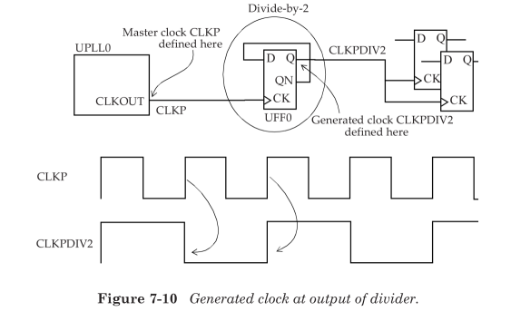

```tcl
# Create a mater with name CLKP of period 10ns
create_clock -name CLKP -period10 [get_pins UPLL0/CLKOUT]
# Create a generated clock with name CLKPDIV2 at Q pin of UFF0
create_generated_clock -name CLKPDIV2 -source [UPLL0/CLKOUT] \
  -divide_by 2 [get_pins UFF0/Q]
```

Can a new clock, that is, a master clock, be defined at the output of the flipflop instead of a generated clock? The answer is yes, that it is indeed possible. However, there are some disadvantages. Defining a master clock instead of a generated clock creates a new clock domain.

Defining the new clock as a generated clock does not create a new clock domain, and the generated clock is considered to be in phase with its master clock. The generated clock does not require additional constraints to be developed. Thus, one must attempt to define a new internally generated clock as a generated clock instead of deciding to declare it as another master clock.

Another important difference between a master clock and a generated clock is the notion of clock origin. In a master clock, the origin of the clock is at the point of definition of the master clock. In a generated clock, the clock origin is that of the master clock and not that of the generated clock.

This implies that in a clock path report, the start point of a clock path is always the master clock definition point. This is a big advantage of a generated clock over defining a new master clock as the source latency is not automatically included for the case of a new master clock.

### Clock latency

Clock latencies can be specified for generated clocks as well.

A source latency specified on a generated clock specifies the latency from the definition of the master clock to the definition of the generated clock.

The total clock latency to a clock pin of a flop-flop being driven by a generated clock is thus the sum of the source latency of the master clock, the source latency of the generated clock and the network latency of the generated clock.

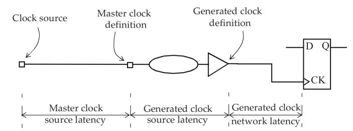

### Defining a new clock

If the input to the and cell are both clocks, then it is safe to define a new main clock at the output of the and cell, since it is highly unlikely that the output of the cell has any phase relationship with either of the input clocks.

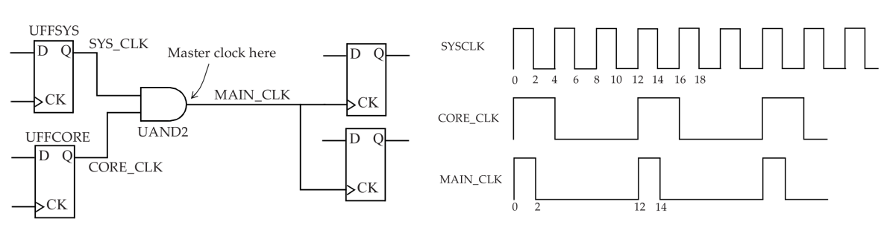

```tcl
create_clock -name SYS_CLK -period 4 -waveform {0 2} [get_pins UFFSYS/Q]
create_clock -name CORE_CLK -period 12 -wave {0 4} [get_pins UFFCORE/Q]
create_clock -name MAIN_CLK -period 12 -wave {0 2} [get_pins UAND2/Z]
```

### Clock Distribution

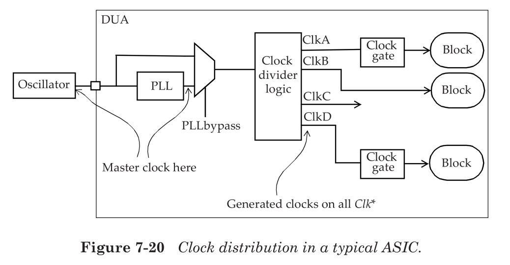


## Constraining Input Paths and Output Path

### Constraining Input Paths

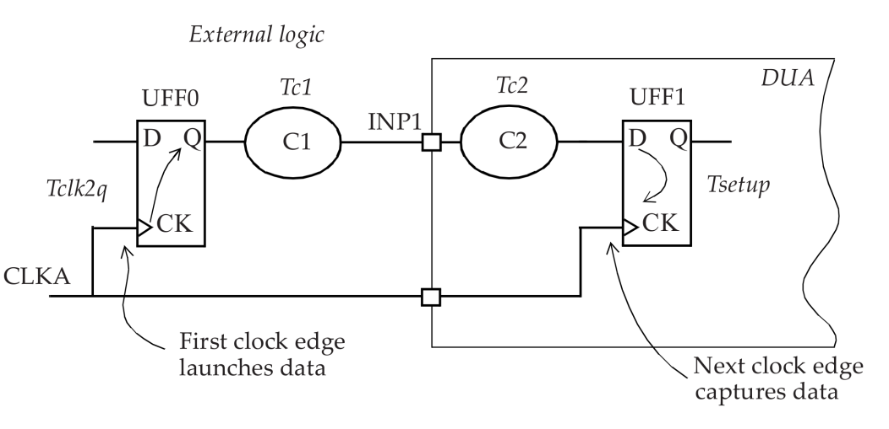

```tcl
set Tclk2q 0.9
set Tc1 0.6
set_input_delay -clock CLKA -max [expr Tclk2q + Tcl] [get_port INP1]
```

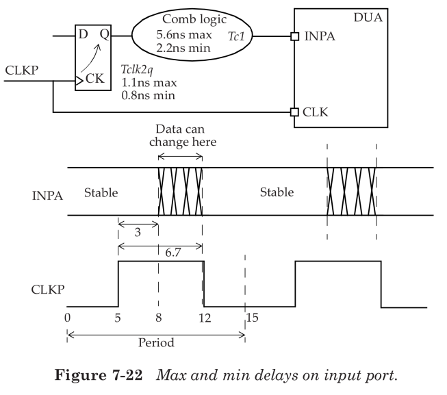

```tcl
create_clock -name CLKP -period 12 -waveform {5 12} [get_ports CLKP]
set_input_delay -clock CLKP -max 6.7 [get_ports INPA]
set_input_delay -clock CLKP -min 3.0 [get_ports INPA]
```

### Constraining Output Delay

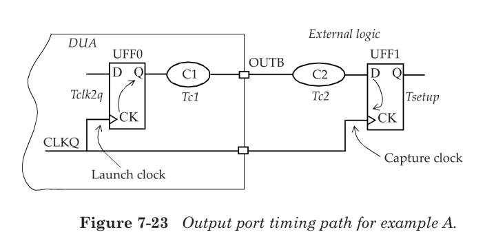

```tcl
set Tc2 3.9
set Tsetup 1.1
set_output_delay -clk CLKQ -max [expr Tc2 + Tsetup] [get_ports OUTB]
```

### Timing Path Groups

Timing paths are sorted into path groups by the clock associated with the **endpoint** of the path. Thus, each clock has a set of paths associated with it.

There is also a default path group that includes all non-clocked (asynchronous) paths.

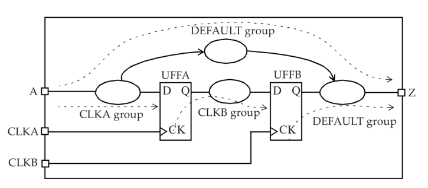

### Modeling of External Attributes

While create_clock, set_input_delay and set_output_delay are enough to constrain all paths in a design for performing timing analysis, these are not enough to obtain accurate timing for the IO pins of the block. The following attributes are also required to accurately model the environment of a design.

For inputs, one needs to specify the slew at the input. This information can be provided using:

- set_drive
- set_driving_cell
- set_input_transition

For outputs, one needs to specify the capacitive load seen by the output pin. This is specified by using the following specification:

- set_load

#### set_drive

The set_drive explicitly specifies a value for the drive resistance at the input pin of the DUA. The smaller the drive value, the higher the drive strength. 

A resistance value of 0 implies an infinite drive strength.

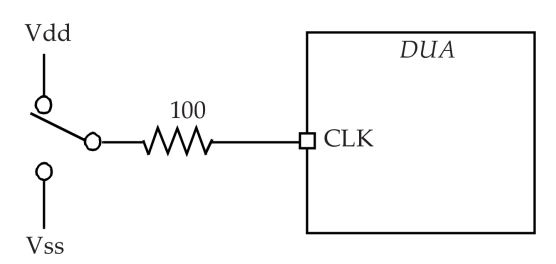

```tcl
# Specifies a drive resistance of 100 on input UCLK:
set_drive 100 UCLK

# Rise drive is different from fall drive:
set_drvie -rise 3 [all_inputs]
set_drive -fall 2 [all_inputs]
```

The drive of an input port is used to calculate the transition time at the first cell. The drive value specified is also used to compute the delay from the input port to the first cell in the presence of any RC interconnect.

```tcl
Delay_to_first_gate = (drive * load_on_net) + interconnect_delay
```

#### set_driving_cell

The set_driving_cell specification offers a more convenient and accurate approach in describing the drive capability of a port.

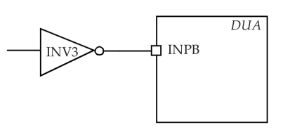

```tcl
# The input INPB is driven by an INV3 cell from library slow
set_driving_cell -lib_cell INV3 -library slow [get_ports INPB]
# Specifies that the cell INV2 from a library tech13g is the driving cell for all inputs.
set_driving_cell -lib_cell INV2 -library tech13g [all_inputs]
# The input testmode[3] is driven by a BUFFD4 cell from library tech90gwc.
set_driving_cell -lib_cell BUFFD4 -library tech90gwc [get_ports {testmode[3]}]
```

#### set_input_transition

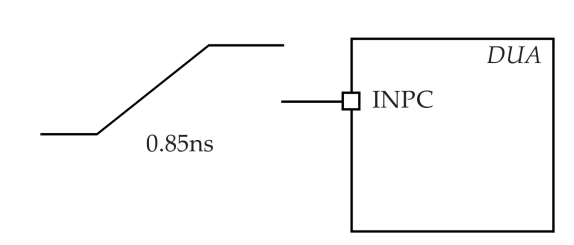

```tcl
# Specifies an input transition of 850ps on port INPC.
set_input_transition 0.85 [get_ports INPC]
# Specifies a transition of 600ps on all input ports.
set_input_transition 0.6 [all_inputs]
# Specifies a transition of 250ps on all ports with pattern SD_DIN*.
# Min and max values can optionally be specified using the -min and -max options.
set_input_transition 0.25 [get_ports SD_DIN*]
```

In summary, a slew value at an input is needed to determine the delay of the first cell in the input path.

In the absence of this specification, an ideal transition value of 0 is assumed, which may not be realistic.

#### set_load

The set_load specification places a capacitive load on output ports to model the external load being driven by the output port. By default, the capacitive load on ports is 0. 

The load can be specified as an explicit capacitance value or as an input pin capacitance of a cell.

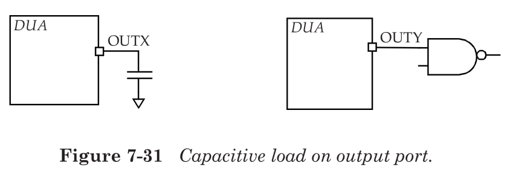

```tcl
# Places a 5pF load on output port OUTX.
set_load 5 [get_ports OUTX]
# Sets 25pF load capacitance on all outputs.
set_load 25 [all_output]
# Place 7fF pin load on the specified output port.
# A load on the net connected to the port can be specified using the -wire_load option
# If neither -pin_load nor -wire_load option is used, 
# the default is the -pin_load option.
set_load -pin_load 0.007 [get_ports {shift_wire[31]}]
# Use pin capacitance of a cell
set_load [get_attribute [get_lib_pins tech_lib/NAND2/A] pin_capacitance] [all_outputs]
```

It is important to specify the load on outputs since this value impacts the delay of the cell driving the output. In the absence of such a specification, a load of 0 is assumed which may not be realistic.


## Design Rule Checks

Two of the frequently used design rules for STA are max transition and max capacitance. These rules check that all ports and pins in the design meet the specified limits for transition time and capacitance. 

These limits can be specified using:

- set_max_transition
- set_max_capacitance

```tcl
# Set a limit of 600ps on IOBANK.
set_max_transition 0.6 IOBANK
# Max capacitance is set to 0.5pf on all nets in current design
set_max_capacitance 0.5 [currect_design]
```

There are other design rule checks that can also be specified for a design.

These are: set_max_fanout (specifies a fanout limit on all pins in design), set_max_area (for a design);

However these checks apply for synthesis and not for STA.


## Virtual Clocks

A virtual clock is a clock that exists but is not associated with any pin or port of the design. It is used as a reference in STA analysis to specify input and output delays relative to a clock.

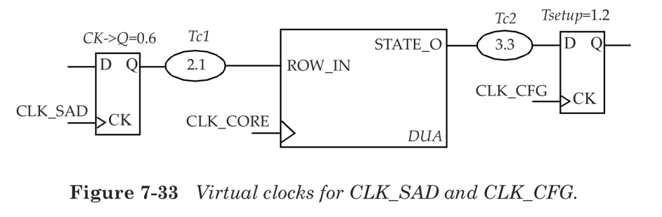

```tcl
create_clock -name VIRTUAL_CLK_SAD -period 10 -waveform {2 8}
create_clock -name VIRTUAL_CLK_CFG -period 8 -waveform {0 4}
create_clock -name CLK_CORE -period 10 [get_ports CLK_CORE]
set_input_delay -clock VIRTUAL_CLK_SAD -max 2.7 [get_ports ROW_IN]
set_output_delay -clock VIRTUAL_CLK_CFG -max 4.5 [get_ports STATE_O]
```


## Refining the Timing Analysis

Four common commands that are used to constrain the analysis space are:

- **set_case_analysis**: Specifies constant value on a pin of a cell, or on an input port.
- **set_disable_timing**: Breaks a timing arc of a cell.
- **set_false_path**: Specifies paths that are not real which implies that these paths are not checked in STA.
- **set_multicycle_path**: Specifies paths that can take longer than one clock cycle

#### set_case_analysis

In a design, certain signals have a constant value in a specific mode of the chip.

For example, if a chip has DFT logic in it, then the TEST pin of the chip should be at 0 in normal functional mode. It is often useful to specify such constant values to STA

```tcl
set_case_analysis 0 TEST
```

#### set_disable_timing

In some situations, it is possible that a certain path through a cell cannot occur. Such a timing arc can be broken by using the set_disable_timing SDC command.

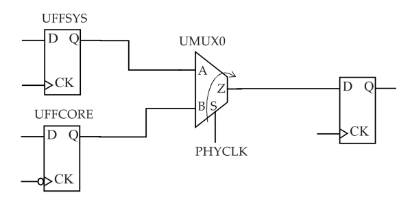

```tcl
set_disable_timing -from S -to Z [get_cells UMUX0]
```

#### set_false_path

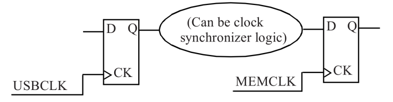

```tcl
set_false_path -from [get_clocks USBCLK] -to [get_clocks MEMCLK]
```


#### set_multicycle_path

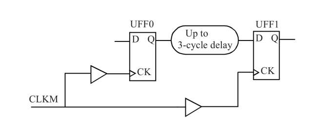

```tcl
create_clock -name CLKM -period 10 [get_ports CLKM]
set_multicycle_path 3 -setup -from [get_pins UFF0/Q] -to [get_pins UFF1/D]
```

