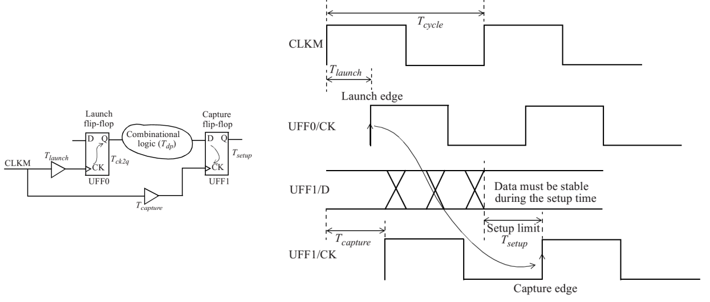
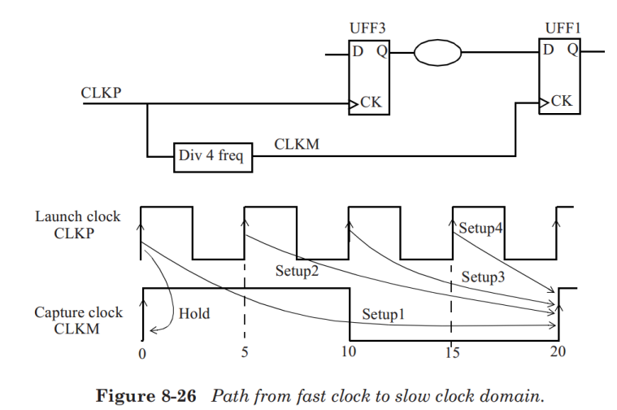

# Timing Verification

[TOC]

## Setup Timing Check



The setup check can be mathematically expressed as:

```tcl
T_launch + T_clk2q + T_dp < T_capture + T_cycle - T_setup
```

#### Input to FF path


```tcl
creat_clock –name VIRTUAL_CLKM –period 10 –waveform {0 5}
set_input_delay –clock VIRTUAL_CLKM –max 2.55 [get_ports INA]
```

#### FF to output path

To determine the delay of the last cell connected to the output port correctly, one needs to specify the load on this port. The output load is specified above using the set_load command.


```tcl
set_output_delay -clock VIRTUAL_CLKP -max 5.1 [get_ports ROUT]
set_load 0.02 [get_ports ROUT]
```

#### Input to Output Path


```tcl
set_input_delay -clock VIRTUAL_CLKM -max 3.6 [get_ports INB]
set_output_delay -clock VIRTUAL_CLKM -max 5.8 [get_ports POUT]
```


## Hold Timing Check

Just like the setup check, a hold timing check is between the launch flipflop - the flip-flop that launches the data, and the capture flip-flop - the flip-flop that captures the data and whose hold time must be satisfied. The clocks to these two flip-flops can be the same or can be different.

The hold check is from one active edge of the clock in the launch flip-flop to **the same clock edge** at the capture flip-flop. Thus, a hold check is **independent** of the clock period.

The hold check is carried out on each active edge of the clock of the capture flip-flop.


The hold check can be mathematically expressed as:

```tcl
T_launch + T_clk2q + T_dp > T_capture + T_hold
```


## Multicycle Path

In some cases, the combinational data path between two flip-flops can take more than one clock cycle to propagate through the logic. In such cases, **the combinational path** is declared as a **multicycle path.**

Even though the data is being captured by the capture flip-flop on every clock edge, **we direct STA that the relevant capture edge occurs after the specified number of clock cycles.**


```tcl
create_clock -name CLKM -period 10 [get_ports CLKM]
set_multicycle_path 3 -setup -from [get_pins UFF0/Q] to [get_pins UFF1/D]
```


In most designs, a multicycle setup specified as N (cycles) should be accompanied by a multicycle hold constraint specified as N-1 (cycles).

```tcl
set_multicycle_path 2 -hold -from [get_pins UFF0/Q] to [get_pins UFF1/D] 
```


What happens when a multicycle setup of N is specified but the corresponding N-1 multicycle hold is missing?

In such a case, the hold check is performed on the edge one cycle prior to the setup capture edge.


## Half-Cycle Path

If a design has both negative-edge triggered flip-flops (active clock edge isfalling edge) and positive-edge triggered flip-flops (active clock edge is rising edge), it is likely that half-cycle paths exist in the design.


While the data path gets only half-cycle for setup check, an extra half-cycle is available for the hold timing check.


## False Path

It is possible that certain timing paths are not real (or not possible) in the actual functional operation of the design. Such paths can be turned off during STA by setting these as false paths.

A false path is ignored by the STA for analysis.

Examples of false paths could be from one clock domain to another clock domain, from a clock pin of a flip-flop to the input of another flip-flop, through a pin of a cell, through pins of multiple cells, or a combination of these.

When a false path is specified through a pin of a cell, all paths that go through that pin are ignored for timing analysis.

The advantage of identifying the false paths is that the analysis space is reduced, thereby allowing the analysis to focus only on the real paths.  This helps cut down the analysis time as well.

However, too many false paths using the through specification can slow down the analysis.

A false path is set using the set_false_path specification. Here are some examples.

```tcl
set_false_path -through [get_pins SAD_CORE/RSTN]
set_false_path -to [get_ports TEST_REG*]
set_false_path -from [get_clocks clockA] -to [get_clocks clockB]
```

Another recommendation is to minimize the usage of -through options, as it adds unnecessary runtime complexity. The -through option should only be used where it is absolutely necessary and there is no alternate way to specify the false path.

From an optimization perspective, another guideline is to not use a false path when a multicycle path is the real intent.

If a signal is sampled at a known or predictable time, no matter how far out, a multicycle path specification should be used so that the path has some constraint and gets optimized to meet the multicycle constraint.

If a false path is used on a path that is sampled many clock cycles later, optimization of the remaining logic may invariably slow this path even beyond what may be necessary.


## Timing across Clock Domains

### Slow to Fast Clock Domains


By default, the most constraining setup edge relationship is used, which in this case is the very next capture edge. Here is a setup path report that shows this.


### Fast to Slow Clock Domains



There are four setup timing checks possible; see Setup1, Setup2, Setup3 and Setup4 in the figure. However, the most restrictive one is the Setup4 check.


## Multiple Clocks

### Integer Multiples

Often there are multiple clocks defined in a design with frequencies that are simple (or integer) multiples of each other.

In such cases, STA is performed by computing a common base period among all related clocks (two clocks are related if they have a data path between their domains).

The common base period is established so that all clocks are synchronized.


setup check:


hold check:


### Non-Integer Multiplies

Consider the case when there is a data path between two clock domains whose frequencies are not multiples of each other.


The timing analysis process computes a common period for the related clocks, and the clocks are then expanded to this base period.

Note that the common period is found only for related clocks (that is, clocks that have timing paths between them).


The setup check occurs over the minimum time between the launch edge and the capture edge of the clock.

### Phase Shifted

Here is an example where two clocks are ninety degrees phase-shifted with respect to each other.

