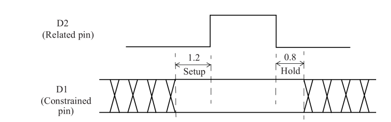

# Robust Verification

[TOC]

## On-Chip Variations

In general, the process and environmental parameters may not be uniform across different portions of the die. Due to process variations, identical MOS transistors in different portions of the die may not have similar characteristics. These differences are due to process variations within the die.

These differences can arise due to many factors, including:

- IR drop variation along the die area affecting the local power supply
- Voltage threshold variation of the PMOS or the NMOS device.
- Channel length variation of the PMOS or the NMOS device.
- Temperature variations due to local hot spots.
- Interconnect metal etch or thickness variations impacting the interconnect resistance or capacitance.

The PVT variations described above are referred to as **On-Chip Variations (OCV)** and these variations can affect the wire delays and cell delays in different portions of the chip.

Since the clock and data paths can be affected differently by the OCV, the timing verification can model the OCV effect by making the PVT conditions for the launch and capture paths to be slightly different.

The STA can include the OCV effect **by derating the delays of specific paths**, that is, by making those paths faster or slower and then validating the behavior of the design with these variations. 

The cell delays or wire delays or both can be derated to model the effect of OCV

### Setup Time Check

We now examine how the OCV derating is done for a setup check.


The worst condition for setup check occurs when the **launch clock path and the data path have the OCV conditions which result in the largest delays**, while **the capture clock path has the OCV conditions which result in the smallest delays.**

For this example, here is the setup timing check condition; this does not include any OCV setting for derating delays.

```
LaunchClockPath + MaxDataPath <= ClockPeriod + CaptureClockPath - Tsetup_UFF1
```

This implies that

```
minimum clock period = LaunchClockPath + MaxDataPath - CaptureClockPath + Tsetup_UFF1
```

From the figure, the minimum clock period is 5.49ns

The above path delays correspond to the delay values without any OCV derating. Cell and net delays can be derated using the set_timing_derate specification.

For example, the commands:

```tcl
set_timing_derate -early 0.8
set_timing_derate -late 1.1
```

Derate the minimum/shortest/early paths by -20% and derate the maximum/longest/latest paths by +10%.

- Long path delays (for example, data paths and launch clock path for setup checks or capture clock paths for hold checks) are multiplied by the derate value specified using the -late option.

- Short path delays (for example, capture clock paths for setup checks or data paths and launch clock paths for hold checks) are multiplied by the derate values specified using the -early option.

If no derating factors are specified, a value of 1.0 is assumed.

The derating factors apply uniformly to all net delays and cell delays. If an application scenario warrants different derating factors for cells and nets, the -cell_delay and the -net_delay options can be used in the set_timing_derate specification.

```tcl
set_timing_derate -cell_delay -early 0.9
set_timing_derate -cell_delay -late 1.0
```

We now apply the following derating to the example.

```tcl
set_timing_derate -early 0.9
set_timing_derate -late 1.0
set_timing_derate -late 1.1 -cell_check
```

With these derate values, we get a minimum clock period of 7.171ns

#### CPPR

In the setup check above, there is a discrepancy since the common clock path of the clock tree, with a delay of 1.2ns, is being derated differently for the launch clock and for the capture clock. This part of the clock tree is common to both the launch clock and the capture clock and should not be derated differently.

Applying different derating for the launch and capture clock is overly pessimistic as in reality this part of the clock tree will really be at only one PVT condition, either as a maximum path or as a minimum path (or anything in between) but never both at the same time.

The pessimism caused by different derating factors applied on the common part of the clock tree is called Common Path Pessimism (CPP) which should be removed during the analysis.

**CPPR, which stands for Common Path Pessimism Removal**, is often listed as a separate item in a path report. It is also labeled as Clock Reconvergence Pessimism Removal (CRPR).

CPPR is the **removal of artificially induced pessimism** between the launch clock path and the capture clock path in timing analysis. If the same clock drives both the capture and the launch flip-flops, then the clock tree will likely share a common portion before branching.

The common point is defined as the output pin of the last cell in the common portion of the clock tree.

```tcl
CPP = LatestArrivalTime@CommonPoint – EarliestArrivalTime@CommonPoint
```

With the CPP correction, the clock period in the above example is 6.811ns

Applying the OCV derating has increased the minimum clock period from 5.49ns to 6.811ns for this example design. This illustrates that the OCV variations modeled by these derating factors can reduce the maximum frequency of operation of the design.

#### Analysis with OCV at Worst PVT Condition

If the setup timing check is being performed at the worst-case PVT condition, no derating is necessary on the late paths as they are already the worst possible.

However, derating can be applied to the early paths by making those paths faster by using a specific derating, for example, speeding up the early paths by 10%.

A derate specification at the worst-case slow corner may be something like:

```tcl
set_timing_derate -early 0.9
set_timing_derate -late 1.0
```

The above derate settings are for max path (or setup) checks at the worstcase slow corner; thus the late path OCV derate setting is kept at 1.0 so as not to slow it beyond the worst-case slow corner.


### Hold Check

If the PVT conditions are different along the chip, the worst condition for hold check occurs：

when **the launch clock path and the data path have OCV conditions which result in the smallest delays**, that is, when we have the earliest launch clock, and **the capture clock path has the OCV conditions which result in the largest delays**, that is, has the latest capture clock.

The hold timing check is specified in the following expression for this example:

```tcl
LaunchClockPath + MinDataPath - CaptureClockPath - Thold_UFF1 >= 0
```

Applying the delay values in the Figure 10-2 to the expression, we get

```tcl
0.85 + 1.7 – 1.00 - 1.25 = 0.3n >=0
```

which is true, and thus no hold violation exists

Applying the following derate specification:

```tcl
set_timing_derate -early 0.9
set_timing_derate -late 1.2
set_timing_derate -early 0.95 -cell_check
```

The hold check condition then becomes: 

```tcl
0.765 + 1.53 – 1.2 - 1.1875 + 0.075 = -0.0175ns < 0
```

In general, the hold timing check is performed at the best-case fast PVT corner. In such a scenario, no derating is necessary on the early paths, as those paths are already the earliest possible. However, derating can be applied on the late paths by making these slower by a specific derating factor, for example, slowing the late paths by 20.

A derate specification at this corner would be something like: 

```tcl
set_timing_derate -early 1.0 
set_timing_derate -late 1.2
```


## Time Borrowing


The time borrowing technique, which is also called cycle stealing, occurs at a latch.

- In a latch, one edge of the clock makes the latch transparent, that is, it opens the latch so that output of the latch is the same as the data input; this clock edge is called the opening edge.
- The second edge of the clock closes the latch, that is, any change on the data input is no longer available at the output of the latch; this clock edge is called the closing edge.

Typically, the data should be ready at a latch input before the active edge of the clock.

However, since a latch is transparent when the clock is active, the data can arrive later than the active clock edge, that is, it can borrow time from the next cycle. 

If such time is borrowed, the time available for the following stage (latch to another sequential cell) is reduced.


Here is an example of time borrowing using an active rising edge

- If data DIN is ready at time A prior to the latch opening on the rising edge of CLK at 10ns, the data flows to the output of the latch as it opens.
- If data arrives at time B as shown for DIN (delayed), it borrows time Tb. However, this reduces the time available from the latch to the next flip-flop UFF2 - instead of a complete clock cycle, only time Ta is available.

The first rule in timing to a latch is that if the data arrives before the opening edge of the latch, the behavior is modeled exactly like a flip-flop. The opening edge captures the data and the same clock edge launches the data as the start point for the next path.

The second rule applies when the data signal arrives while the latch is transparent (between the opening and the closing edge). The output of the latch, rather than the clock pin, is used as the launch point for the next stage. The amount of time borrowed by the path ending at the latch determines the launch time for the next stage.

The timing regions for data arrival for positive slack, zero slack, and negative slack (that is, when a violation occurs).


A data signal that arrives after the closing edge at the latch is a timing violation


## Data to Data Checks

Setup and hold checks can also be applied between any two arbitrary data Pins, neither of which is a clock.


- One pin is the constrained pin, which acts like a data pin of a flip-flop
- The second pin is the related pin, which acts like a clock pin of a flip-flop.

Distinction with respect to the setup check

- The data to data setup check is performed on **the same edge** as the **launch** edge
- Unlike a normal setup check of a flip-flop, where the capture clock edge is normally one cycle away from the launch clock edge

Thus, the data to data setup checks are also referred to as zero-cycle checks or same-cycle checks.

A data to data check is specified using the set_data_check constraint. Here are example SDC specifications. The data to data setup check is performed on the same edge as the launch edge:

```tck
set_data_check -from SDA -to SCTRL -setup 2.1
set_data_check -from SDA -to SCTRL -hold 1.5
```


- The setup data check implies that SCTRL should arrive at least 2.1ns prior to the edge of the related pin SDA. Otherwise it is a data to data setup check violation.
- The hold data check specifies that SCTRL should arrive at least 1.5ns after SDA. If the constrained signal arrives earlier than this specification, then it is a data to data hold check violation

This check is useful in a custom-designed block where it may be necessary to provide specific arrival times of one signal with respect to another.

One such common situation is that of a data signal gated by an enable signal and it is required to ensure that the enable signal is stable when the data signal arrives.

One important aspect of a data to data setup check is that the clock edges that launch both the constrained pin and the related pin are from the same clock cycle (also referred to as same-cycle checks).

#### No-change data check

The data to data check is also useful in defining a no-change data check.

This is done by specifying a setup check on the rising edge and a hold check on the falling edge, such that a no-change window gets effectively defined.



```tcl
set_data_check -rise_from D2 -to D1 -setup 1.2
set_data_check -fall_from D2 -to D1 -hold 0.8
```