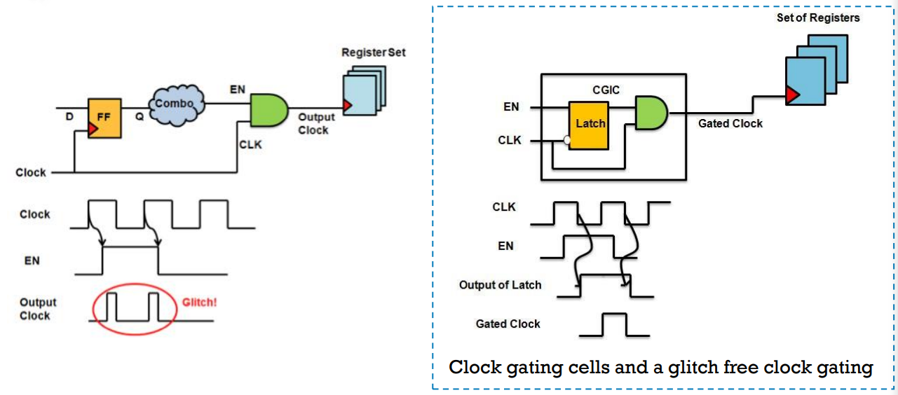
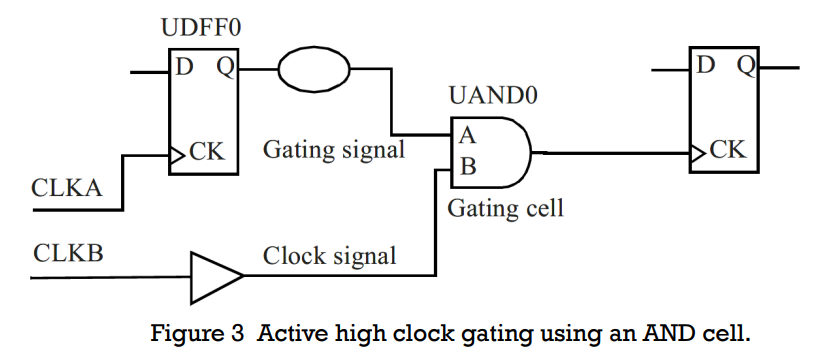
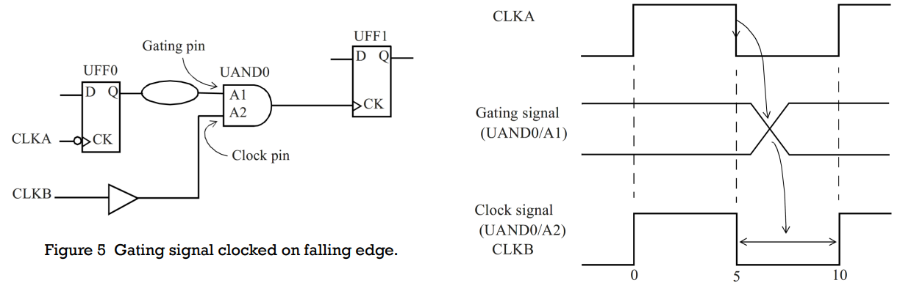
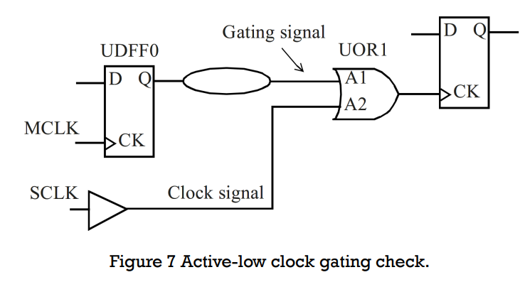
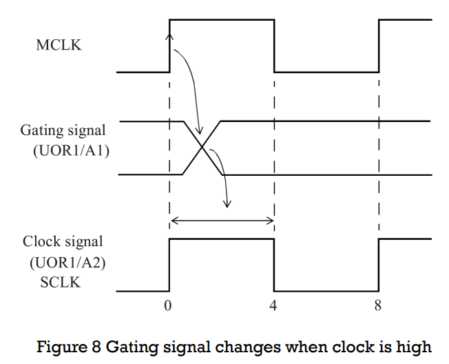
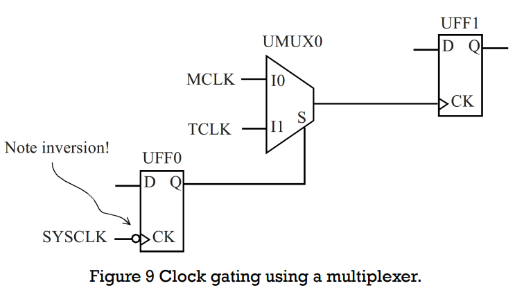
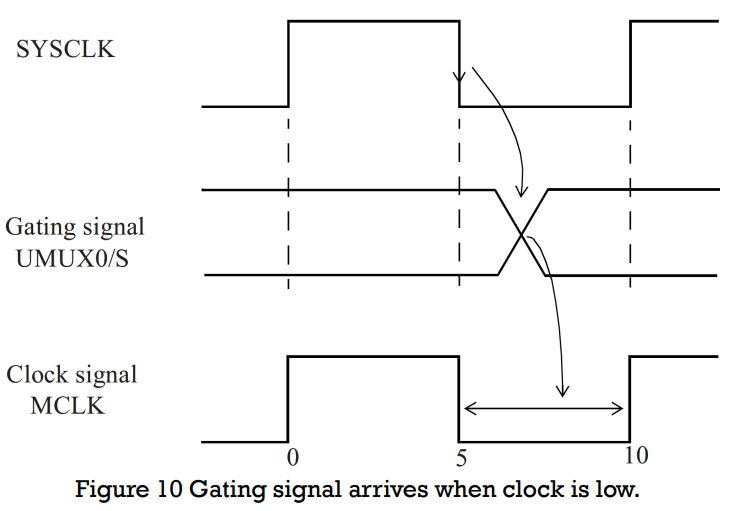

# Clock Gating Check

[TOC]

## Glock gating



A clock gating check occurs when a gating signal can control the path of a clock signal at a logic cell.


## Clock Gating check

Conditions for a clock gating check：

- The clock that goes through the cell must be used as a clock downstream. **If the clock is not used as a clock after the gating cell, then no clock gating check is inferred.**

- Another condition for the clock gating check applies to the gating signal. The signal at the gating pin of the check should not be a clock or if it is a clock, it should not be used as a clock downstream

There are two types of clock gating checks inferred:

- Active-high clock gating check: Occurs when the gating cell has an **and** or a **nand** function.
- Active-low clock gating check: Occurs when the gating cell has an **or** or a **nor** function.

The active-high and active-low refer to the logic state of the gating signal which activates the clock signal at the output of the gating cell.

If the gating cell is a complex function where the gating relationship is not obvious, such as a **multiplexer** or an **xor** cell, STA output will typically provide a warning that no clock gating check is being inferred.

However this can be changed by specifying a clock gating relationship for the gating cell explicitly by using the command: `set_clock_gating_check`.

### Active-High Clock Gating



Assume that both clocks CLKA and CLKB have the same waveforms.

```tcl
create_clock -name CLKA -period 10 -waveform {0 5} [get_ports CLKA]
create_clock -name CLKB -period 10 -waveform {0 5} [get_ports CLKB]
```

- The active-high clock gating setup check requires that the gating signal changes **before the clock goes high**.
- The active-high clock gating hold check requires that the gating signal changes **only after the falling edge of the clock.**

The above design does not meet the hold time requirement. This can be resolved by using a different type of launch flip-flop, say, **a negative edge-triggered flip-flop** to generate the gating signal. Such an example is shown next.



Safe clock gating implies that the output of flip-flop UFF0 must change during the inactive part of the gating clock, which is between 5ns and 10ns.

### Active-Low Clock Checking



```tcl
create_clock -name MCLK -period 8 -waveform {0 4} [get_ports MCLK]
create_clock -name SCLK -period 8 -waveform {0 4} [get_ports SCLK]
```

The gating signal should switch only when the clock is high as illustrated in Figure 8



### Clock Gating with a Multiplexer



A clock gating check at the multiplexer inputs ensures that the multiplexer select signal arrives at the right time to cleanly switch between MCLK and TCLK.



Since the gating cell is a multiplexer, the clock gating check is **not inferred automatically**, as evidenced in this message reported during STA.

However a clock gating check can be explicitly forced by providing **a `set_clock_gating_check` specification.**

```tcl
set_clock_gating_check -high [get_cells UMUX0]
set_disable_clock_gating_check UMUX0/I1
```

- The disable check turns off the clock gating check on the specific pin, as we are not concerned with this pin.

- The clock gating check on the multiplexer has been specified to be an active-high clock gating check


