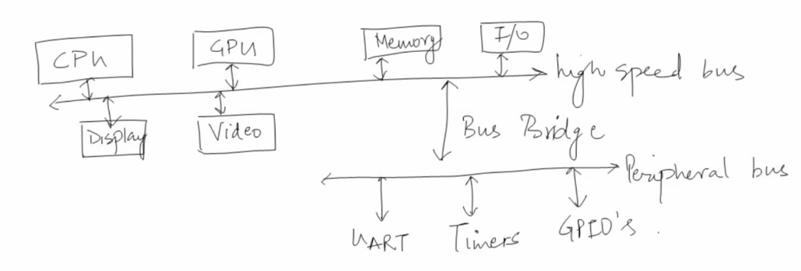
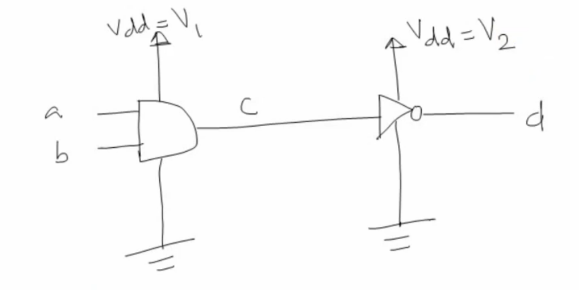

# Need of UPF and UPF basics

[TOC]

## VLSI Design Phases

### VLSI/Chip Design Flow

1. Market analysis and Product Specification
2. Design Specification
3. Design Entry (HDL)
4. Functional Verification
   1. GLS
   2. Formal verification
   3. **Power aware simulation**
   4. **Power estimation**
5. Logic Synthesis <-- Tech library
6. Floor Planning
7. Layout/Place & Route
8. Physical Verification
9. Tape out

2 - 4: Front-end/Verification

5 - 8: Backend design

### Moore's Law

Every 18 month, number of transistor on a chip will double. This means:

- Every 18 month, Gate length will reduce by sqrt(2) 
- Every 18 month, in same area, we can pack twice the transistor 

### Dynamic Power

$$
P_d = \alpha CV^2f
$$

C = Capacitance

V = Voltage

f = Frequency

alpha = Switching activity

**If transistor increase, Capacitance and Switching activating will also increase. That's why minimizing power is important.** 

### Design Example

CPU: run at 3 GHz, voltage range: 0.8V - 1.6V

Video: run at 2GHz, voltage range: 0.6V - 1.2V

2 options:

1. Use 0.8V for both CPU and Video core. 
   - Simpler design
   - More power consumption on video core.
2. Use 0.8V for CPU and 0.6V for Video. 
   - Save power on video core
   - Need special handling on signal crossing CPU and Video core.

## RTL Simulation Vs Power Aware UPF Simulation

### Behavioral Modeling (RTL Simulation)

#### Example 1 Inverter

In RTL simulation, Vdd and Vss are assume to be always getting its desired value. 

However, this may not be true in real silicon. What if Vdd and Vss are not connected properly. This can't be caught using RTL simulation. This can be tested using power aware verification using UPF.

#### Example 2

RTL simulation: c = a & b, d = ~c independent of V1 V2, Vss

Case 1: if V1 is Off and V2 is On, then c will be indeterministic and d will also be indeterministic (because c is indeterministic)

Case 2: if V1 is On and V2 is Off, then c = a & b but d will be indeterministic.

Case 3: if V1 is Off and V2 is Off, then both c and d will be indeterministic.

Case 4: if V1 is On and V2 is On, then c = a & b, d = ~c.

RTL simulation can't catch case 1, 2, 3. 

#### Example 3

Same schematic before but assume V1 != V2.

V1 = 1V.		> 0.4V -> logic 1, < 0.3V -> logic 0

V2 = 0.5V. 	> 0.25 -> logic 1, < 0.2 -> logic 0

Assume that C = 0.26V, then C will be considered 0 in V1 domain but 1 in V2 domain, then d will be 0 which is wrong.

We need a **level shifter** for C to correct the logic level in V2 domain.

If V1 is Off and V2 is On, then c will be indeterministic which will corrupt d too. 

We need an **isolation cell** to make input to the inverter deterministic.

## UPF Basics

- UPF: Unified Power Format

- UPF History: 
  - UPF1.0 (2007, Accellera UPF)
  - UPF2.0 (2008, IEEE1801-2009)
  - UFP2.1 (2013, IEEE1801-2013)
  - UPF3.0  (2015, IEEE1801-2015)

- UPF is based on TCL language

- UPF is used for verification and for implementation

### UPF Components

- Power Domain
- Power Supply Network
- Power State Table
- Isolation Cells
- Level Shifter
- Retention Cells
- Repeater Strategy

