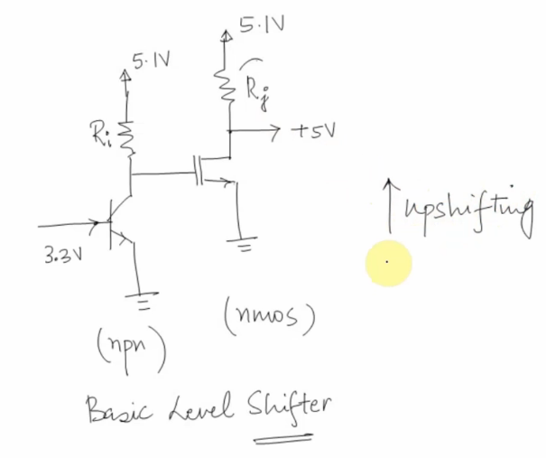
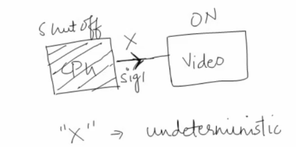
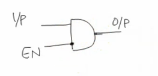
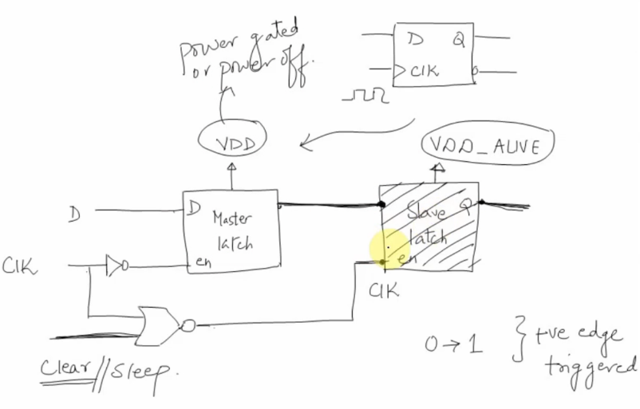
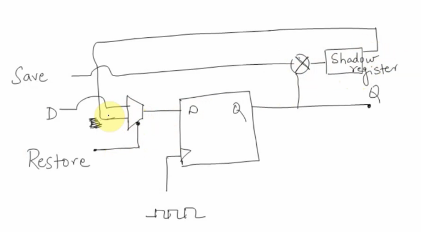
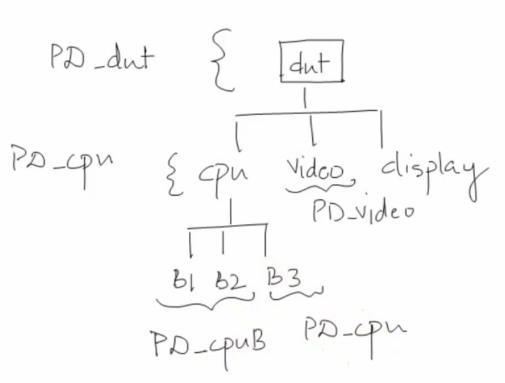
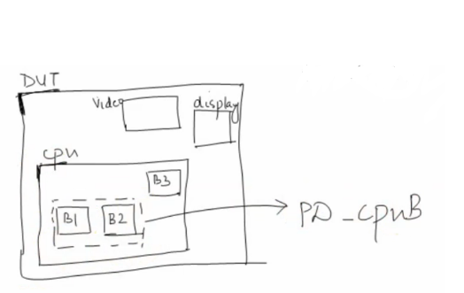

# UPF Power Aware Design

[TOC]

## Power Domains

Group of elements that share common set of supply (power) requirement.


Let's assume our current scope is “dut”, cpu and Video are in different power domain.

```tcl
set_scope dut
create_power_domain PD_dut -include_scope		# Create a power domain for the entire DUT
create_power_domain PD_cpu -element {cpu} 		# Create a power domain for CPU
create_power_domain PD_video -element {video} 	# Create a power domain for video
```

Now, assume that for CPU block, B1 and B2 are in a different power then CPU, we need to create another power domain

```tcl
create_power_domain PD_cpuB -element {cpu/B1 cpu/B2}
```

Now assume that for Video block, B'2 and B'3 are in a different power then Video, we need to create another power domain.

```tcl
create_power_domain PD_videoB -element {video/Bh2 video/Bh3}
```

## Power Supply Network

Power Supply Networks:

- ports: connection point for supply nets
- nets: HDL representation of a power rail
- sets
- switches

### Supply Nets/Ports

#### create_supply_net

```tcl
create_supply_net VDD_H -domain PD_cpu
create_supply_net VDD_H -domain PD_cpuB -reuse -resolve <unresolved/parallel/one_hot/parallel_one_hot/function>
create_supply_net VDD_L -domain PD_video
```

- A supply net is defined under a power domain
- Add -reuse if the net has already been defined in another power domain


#### create_supply_port

```tcl
create_supply_port VDD_H -domain PD_cpu -direction <in/out/inout>
# connect top level power domain supply port to supply net
connect_supply_net VDD_H -ports VDD_H
```

- A supply port is defined under a power domain
- A supply port has direction. Default direction is input

#### Supply Nets/Ports - Example


```tcl
create_supply_port VDD_H -domain PD_cpu
create_supply_port VSS -domain PD_cpu
create_supply_port VSS -domain PD_video
create_supply_port Vint -domain PD_cpu -direction output
create_supply_port Vint -domain PD_video

create_supply_net VDD_H -domain PD_cpu
create_supply_net Vint -domain PD_cpu
create_supply_net Vint -domain PD_video -reuse

connect_supply_net VDD_H -ports VDD_H
connect_supply_net Vint -port Vint
```

### Supply Sets

When we create power domain, it creates the following implicit power supply set:

```tcl
# When we create a power domain
create_power_domain PD_cpu -element {cpu}
# It create the following power supply set implicitly
pd_cpu primary
pd_cpu default_isolation
pd_cpu default_retention
```

Advantage of using supply set:

1. Good for abstraction
2. Simplifies UPF creation
3. Reusable UPF IP
4. Flexibilities on creating isolation and retention
5. Automatic backend flow using nwell/pwell function

#### Supply Sets - Example

```tcl
create_supply_set SS_1 -function {power} -function {ground} -function {nwell}
```

### Power Switch


Block B1 is in a different power domain then CPU, the power supply port for B1 is Vdd_h_gated and the power supply port for CPU is Vdd_h. There is a power switch between Vdd_h and Vdd_h_gated.

When pg_en = 1, Vdd_h_gated = Vdd_h (ON state)

When pg_en = 0, Vdd_h_gated = OFF state

pg_en is usually coming from PMU.

To implement power switch in UPF

```tcl
set pg_en dut.pmu.gp_en
create_power_switch psw_vdd_h_gated -domain PD_cpu \
	-output_supply_port "vccout Vdd_h_gated"
	-input_supply_port "vccin Vdd_h"
	-on_state "ON vccin EN"
	-off_state "OFF !EN"
	-control_port "EN $pg_en"
```

## Power State Table


Assume we have created the following:

- create_power_domain
- create_supply_port
- create_supply_net
- connect_supply_net

These are the valid power status in the design

|        | CPU   | Video | Display |
| ------ | ----- | ----- | ------- |
| ALLOFF | C_OFF | V_OFF | D_OFF   |
| LOWP_1 | C_ON  | V_OFF | D_OFF   |
| LOWP_2 | C_ON  | V_ON  | D_OFF   |
| ALLON  | C_ON  | V_ON  | D_ON    |

To add state, we need to use `add_port_state` command

```tcl
add_port_state VDD_C -state {C_ON 1.0} -state {C_OFF off}
add_port_state VDD_V -state {V_ON 1.2} -state {V_OFF off}
add_port_state VDD_D -state {D_ON 0.9} -state {D_OFF off}
```

To create power table, use `create_pst` and `add_pst_state`

```tcl
create_pst TOP_PST -supplies {VDD_C VDD_V VDD_D}
add_pst_state ALLOFF -pst TOP_PST -state {C_OFF V_OFF D_OFF}
add_pst_state LOWP_1 -pst TOP_PST -state {C_ON V_OFF D_OFF}
add_pst_state LOWP_2 -pst TOP_PST -state {C_ON V_ON D_OFF}
add_pst_state ALLON -pst TOP_PST -state {C_ON V_ON D_ON}
```

Note on power on/off:

Power On means power is supplied. It can be supplied to 0V, 1V, 2V, etc.

Power OFF means power is not connected.

So VSS is connected to 0V is different then VSS is OFF

## Level Shifters


We need a level shifter from cpu to video.



An upshifting level shifter.

UPF command:

```tcl
set_level_shifter LS_CPU_VIDEO -domain PD_cpu -applies_to outputs -location self
```

location can be: 

- self (default): level shifter should be placed in the self domain.
- parent: level shifter should be placed in the parent domain.
- other
- fanout: level shifted should be placed in each fanout domain.

## Isolation Cells



If CPU domain is shut off, then output signal will be indeterministic which will corrupts the internal signal in Video domain.

Isolation Cells Example:



- Isolation enable should be asserted before the CPU domain is powered down. 
- The location of isolation cell is important. Isolation cell should be put at active domain. Power supply for isolation should always be ON.
- Enable signal should not be isolated and it should belong to ON domain

UPF command:

```tcl
set_isolation ISO_CPU_VIDEO \
	-domain <domain_name> \
	-applies_to outputs	\
	-clamp_value <0/1/latch/Z> \
	-isolation-signal <isolation_enable> \
	-isolation_sense low/high \
	-location self
```

###  Input vs Output Isolation Cells

Power supply for the isolation cells should come from the ON domain, instead of the domain that will be shut off.

**Input isolation cells**: The isolation cells are located in the ON PD as input.

Pros of input isolation: 

- can use the power supply from the domain itself since this domain is ON.
- no redundant isolation cell.

Cons of input isolation:

- make the design more complex. need to make sure that all the signals that need isolation are isolated.

**Output isolation cells**: The isolation cells are located in the OFF PD as output.

Pros of output isolation: 

- simplify the design. it make sure that all the output signals are isolated

Cons of output isolation:

- Need to introduce another ON power rail to this power domain as the isolation cell needs power supply when the domain is OFF.
- Might create redundant isolation cell.

## Retention Cells

Retention cells: save the value before power off and then restore the value after power on

The purpose of having retention cells: when we power off some logic, we want to keep the value of some signals so that when we power back the logic, we can restore the state of the signals before powering off the logic. Otherwise, we have to reset the logic. This is a trade off between power and performance.

There are two common retention cells:

1. single port master/slave alive
2. dual port (save/restore port) balloon latch

### master/slave alive retention cells



low leakage, high threshold voltage transistor is used. lower performance but more area saving.

### balloon latch retention cells



Pros: better performance

Cons: more area is used

### UPF Command: set_retention

```tcl
set_retention retain_a_b \
	-domain PD_a \
	-retention_power_net <> \
	-retention_ground_net <> \
	-elements {}
	
set_retention_control retain-a_b \ 
	-domain PD_a \
	-save_signal {} \
	-restore_signal {} \
```

## Flat UPF vs Hierarchical UPF





Flat UPF: define everything under the DUT in a single UPF file

Hierarchical UPF:

Example:

```tcl
# dut.upf
set_scope dut
create_power_domain PD_dut
create_supply_port VDD
load_upf cpu.upf -scope cpu
load_upf video.upf -scope video
```

```tcl
# cpu.upf
set_scope cpu
...
```

```tcl
# video.upf
set_scope video
...
```

## UPF Evolution 1.0 vs 2.0 vs 2.1 vs 3.0

### 2007 - Accellera UPF 1.0

- set_scope
- create_power_domain
- create_supply_port
- create_supply_net
- connect_supply_net
- create_power_siwth
- create_pst*
- add_pst_state*
- add_port_state*
- set_ioslation
- set_ioslation_control*
- set_retention
- set_retention_control*
- load_upf
- save_upf
- upf_version

\* *UPF 1.0/2.0 only*

### 2009 - IEEE1801-2009 UPF 2.0 

Introduced the following command

- create_supply_set
- add_power_state
- connect_supply_set

### 2013 IEEE1801-2013 UPF 2.1

Removed the following command

- ~~set_ioslation_control~~
- ~~set_retention_control~~
- ~~create_pst~~
- ~~add_pst_state~~
- ~~add_port_state~~

Introduced the following command

- begin_power_model
- end_power_model
- apply_power_model

### 2015 IEEE1801-2015 UPF 3.0

- Information Modeling Database (IMDB)
